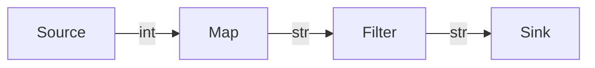

# Eidos Zero: Symbolism (The Logic Frontend)

## 1. The Philosophy of Symbolism

In Eidos, **"Code is Topology"**. When you write a pipeline in Python using Eidos's DSL, you are not executing commands; you are defining a rigorous, immutable **Computational Graph** (Abstract Syntax Tree).

This separation of definition (Symbolism) from execution (Dynamics) enables:
*   **Static Analysis**: Detecting type errors and cycles before running.
*   **Transpilation**: Compiling the same logic to Polars, Ray, or SQL.
*   **Governance**: Automatically generating lineage and documentation.

## 2. The Algebra of Operators

Eidos redefines standard Python operators to create a semantic algebra for data flow.

### 2.1 The Flow Operator (`>>`)
**Symbol**: `Compose` / `Pipe`
**Meaning**: "Pass the output of A as the input to B."

```python
# x -> f(x) -> g(f(x))
pipeline = Source("data") >> Map(f) >> Map(g) >> Sink("db")
```

This builds a directed edge in the AST. The types must match: `Out(A)` must be compatible with `In(B)`.

### 2.2 The Choice Operator (`|`)
**Symbol**: `Alternative` / `Fallback`
**Meaning**: "Try A. If A produces a value, use it. If A fails or returns None/Empty, try B."

```python
# Try reading from Redis cache, if miss, read from DB
fetch_strategy = RedisSource("cache") | PostgresSource("db")
```

In the AST, this creates a `ChoiceNode` (Fork). The compiler optimizes this into a conditional execution path (e.g., `COALESCE` in SQL).

### 2.3 The Ensemble Operator (`&`)
**Symbol**: `Concurrent` / `Product`
**Meaning**: "Execute A and B in parallel/independently on the same input."

```python
# Input -> (A(Input), B(Input))
parallel = AnalysisA() & AnalysisB()
```

In the AST, this creates a `ParallelNode`. The output is a **Tuple** (or a Joined Record) of the results.
*   **Vector Lane**: Compiles to independent column expressions (`df.with_columns(...)`).
*   **Cluster Lane**: Compiles to parallel tasks on different workers.

### 2.4 The Interference Operator (`+`)
**Symbol**: `Superposition` / `Reduce`
**Meaning**: "Execute A and B, then combine their results using a commutative operation (Sum/Merge)."

```python
# Result = A(x) + B(x)
total_score = ScoreModelA() + ScoreModelB()
```

If the operands are streams, this acts as a **Union**. If they are scalars/metrics, it acts as a **Sum**.

## 3. Operator Algebra vs. Stream Algebra

Eidos supports algebra at both the **Operator** level and the **Stream** level.

### 3.1 Operator Algebra (Composition)
Combines functional logic before applying it to data.
```python
# Define a complex operator
op = (Map(f) | Map(g)) >> Filter(h)

# Apply it
stream >> op
```

### 3.2 Stream Algebra (Topology)
Combines data flows directly.
```python
s1 = Source("A")
s2 = Source("B")

# Union/Fallback
s3 = s1 | s2 

# Parallel/Zip
s4 = s1 & s2

# Merge
s5 = s1 + s2
```

## 4. The Type System (Operator[In, Out])

Eidos enforces type safety at construction time using Python Generics.

```python
from eidos import Operator

class MyOp(Operator[int, str]):
    def __call__(self, x: int) -> str:
        return str(x)

# Valid
valid = Source[int]() >> MyOp()

# Invalid (Static Error)
invalid = Source[float]() >> MyOp() 
# Error: Cannot pipe float into Operator[int, str]
```

This prevents "Runtime Surprises". The AST is guaranteed to be type-consistent.

## 4. The AST Structure

The DSL builds an AST in memory. This tree is composed of immutable `Node` objects.

### 4.1 Node Schema
```python
@dataclass(frozen=True)
class Node:
    id: str
    op_type: OpType
    config: Dict[str, Any]
    parents: List[str]
    
    # Metadata populated during compilation
    schema_in: Optional[Schema] = None
    schema_out: Optional[Schema] = None
```

### 4.2 Immutability
The Graph is **immutable**. Operations like `>>` do not modify the existing graph; they return a **new** graph state. This makes the DSL functional and thread-safe.

## 5. Static Analysis

Before execution, the `Compiler.verify(graph)` pass performs:

1.  **Cycle Detection**: Ensures the graph is a DAG (Directed Acyclic Graph).
2.  **Orphan Check**: Warns about nodes that generate data but are not connected to a Sink.
3.  **Schema Validation**: Checks Pydantic schemas between connected nodes.


