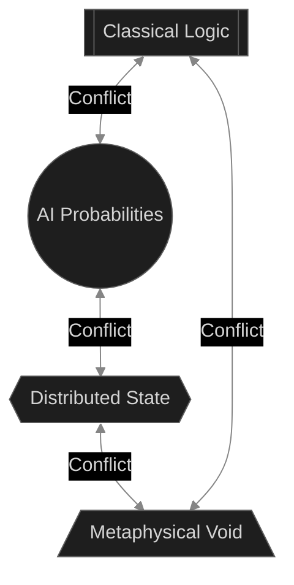
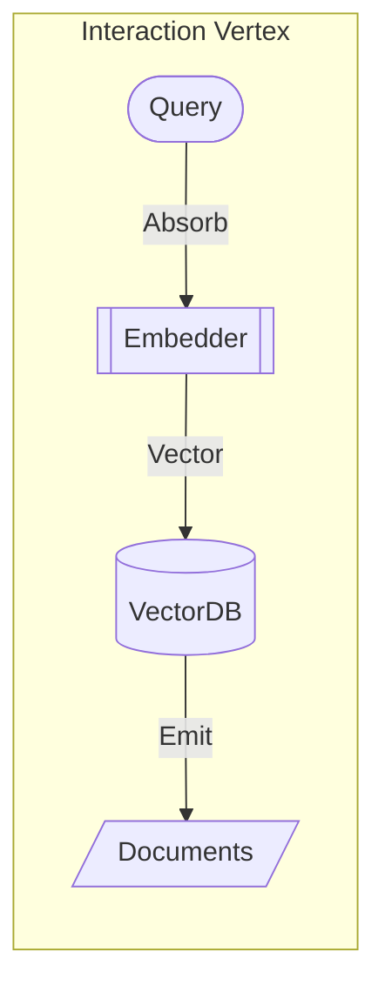
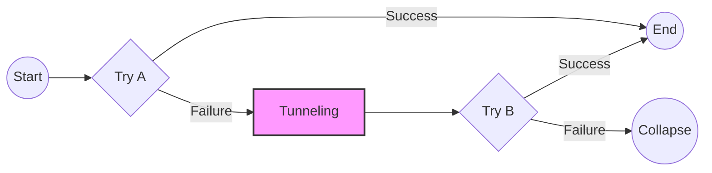
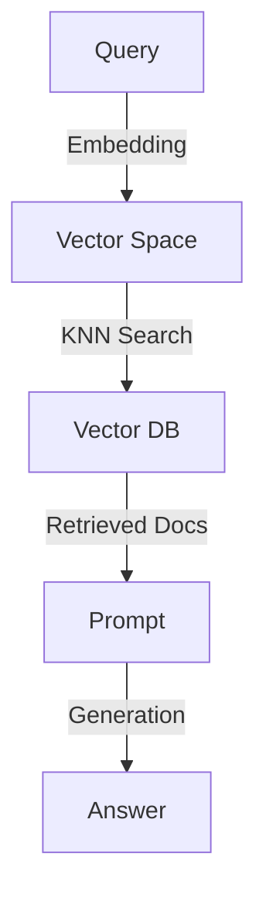

# THE EIGEN COSMOLOGY

> The Grand Unified Theory of the Eigen Framework

---

<!-- SOURCE: foundations\01_PREFACE_THE_CRISIS.md -->

# Book I: PREFACE - The Crisis of Entropy

> "The second law of thermodynamics states that the total entropy of an isolated system can never decrease over time." — Rudolf Clausius

## 1.1 The Thermodynamic Nature of Software

In the history of software engineering, we have invented thousands of tools—Agile, DevOps, Microservices, Serverless, AI. Yet, one fundamental constant remains: **Systems decay.**

Why does code rot? Why do architectures that start clean inevitably become "Big Balls of Mud"? Why does adding a feature to a 10-year-old codebase cost 100x more than adding it to a greenfield one?

The **Eigen Framework** posits that this is not a failure of discipline, management, or tooling. It is a **Physical Inevitability**. Software systems are not abstract mathematical proofs existing in a vacuum; they are **Thermodynamic Systems** bounded by finite energy (developer time) and information capacity (cognitive load).

### The Definition of Software Entropy ($S$)

We define Software Entropy $S$ as the measure of disorder in the dependency graph.

$$ S = k_B \ln \Omega $$

Where:
*   $k_B$ is the **Boltzmann constant** of the organization. It represents the friction of communication. A small team has a low $k_B$; a bureaucracy has a high $k_B$.
*   $\Omega$ (Omega) is the number of possible **microstates** (valid configurations) of the system.

As we add features (energy), $\Omega$ grows exponentially. A system with 2 variables has 4 states. A system with 100 variables has $2^{100}$ states.
Without an external force to reduce disorder (Refactoring), $S$ increases spontaneously ($\Delta S > 0$).

#### The Maxwell's Demon of Code
In physics, Maxwell's Demon is a hypothetical being that decreases entropy by sorting particles. In software, this is the **Maintainer**.
*   **Refactoring** is the act of expending energy to lower $\Omega$.
*   **Technical Debt** is the accumulation of entropy when the Demon sleeps.

However, refactoring costs energy ($E$). According to Landauer's Principle, erasing information (simplifying code) requires heat dissipation.
$$ E \ge k_B T \ln 2 $$
This means **simplification is physically expensive**. Most organizations prefer to add complexity (which is cheap) rather than remove it (which is expensive). This leads to the heat death.

### The Heat Death of Software

When $S$ maximizes, the system reaches **Thermodynamic Equilibrium**. In software terms, this is **Legacy Gridlock**.
*   **No new energy** (features) can be added without infinite work.
*   Every change causes a random cascade of side effects.
*   The system is effectively "dead", even if it is still running.

## 1.2 The Five Eras of Complexity

We can categorize the history of computing by the physical laws that dominated them.

| Era | Timeframe | Physics Model | Dominant Force | Structure | Failure Mode |
| :--- | :--- | :--- | :--- | :--- | :--- |
| **I. Monolithic** | 1970-2010 | **Classical Mechanics** | Gravity (Coupling) | Single Binary, ACID | **Rigidity**. Inertia prevents movement. Collapse into Black Hole. |
| **II. Distributed** | 2010-2023 | **Relativity** | Light Speed (Latency) | Microservices, Eventual Consistency | **Chaos**. Broken causality. Unobservable state vectors. |
| **III. AI / Eigen** | 2023-2025 | **Quantum Mechanics** | Probability | Agents, Vectors, Entanglement | **Decoherence**. Hallucination. Probabilistic collapse. |
| **IV. Renormalization**| 2025-2030 | **Stat. Mechanics** | Scale (Criticality) | Fractals, Phase Transitions | **Divergence**. Scale-invariance breakdown. |
| **V. The Void** | 2030+ | **Metaphysics** | Vacuity (Wu Wei) | Prescience, Zero Latency | **Nirvana**. The End of Code. |

### Era 1: The Monolithic Era (Classical Mechanics)
*   **Physics**: Newton's Laws. Deterministic, centralized, absolute time.
*   **Mechanism**: Function calls are instantaneous. Memory is shared.
*   **The Trap**: As mass ($M$) increases, Gravity ($G \frac{M_1 M_2}{r^2}$) increases. Modules become so tightly coupled that they fuse into a neutron star.

### Era 2: The Distributed Era (Relativity)
*   **Physics**: Einstein's Relativity. No absolute time, observer dependence.
*   **Mechanism**: RPC calls over a network. Light cone is limited by latency ($c$).
*   **The Trap**: The "Twin Paradox" of data. Service A thinks the user is active; Service B thinks they are deleted. Both are right in their own reference frame. Reconciling them requires infinite energy (CAP Theorem).

### Era 3: The AI Era (Quantum Mechanics)
*   **Physics**: Schrödinger's Equation. Probabilistic states, non-determinism, entanglement.
*   **Mechanism**: LLMs generate tokens based on probability distributions ($P(x)$).
*   **The Trap**: **Superposition**. An AI agent is simultaneously "correct" and "hallucinating" until you observe the output. Testing becomes non-deterministic.

### Era 4 & 5: The Future (Renormalization & Void)
*   **Renormalization**: Systems that automatically adapt their structure (Phase Transition) based on scale ($\Lambda$).
*   **The Void**: Systems that anticipate intent, effectively operating with negative latency ($\Delta t < 0$).

## 1.3 The Singularity: The Integration Crisis

We are currently entering the **Singularity**—a point where a single system must integrate all eras simultaneously.

**The Crisis**: We are trying to build Era 3+ systems using Era 1 tools (Objects) or Era 2 tools (Microservices).
*   Objects assume strict state control.
*   Microservices assume interface stability.
*   AI breaks both.

### The Diagram of Doom


## 1.4 The Eigen Solution: A Unified Physics

**Eigen is the Grand Unified Theory (GUT) for Software.**

It provides a single mathematical formalism—**The Operator**—to express all mechanics.
*   **Classical Logic**: `Choice Operator (|)` collapses probability.
*   **Relativistic Flow**: `Flow Operator (>>)` handles async causality.
*   **Quantum State**: `Entanglement Operator (&)` handles high-dimensional vector spaces.
*   **Renormalization**: `RG Operator` handles scale transformations.
*   **Void**: `Prescience Operator` handles negative latency.

In Eigen, we do not write "code" to manage entropy. We define **Hamiltonians** ($H$)—energy functions that describe how the system evolves. We let the **Matrix Engine** (JIT Compiler) find the path of Least Action.

### The Manifesto

We hold these truths to be self-evident:

1.  **Code is Physics.** It obeys laws of conservation and action.
2.  **Syntax is Geography.** Topology matters more than naming.
3.  **Operators are Universal.** Logic is scale-invariant.
4.  **Invariance is Truth.** Laws should not change with coordinates.
5.  **Action is Cost.** The best code is no code (Wu Wei).

**Eigen is not just a library. It is a new Physics for the Digital Universe.**
Welcome to the Omega Point.


---

<!-- SOURCE: foundations\02_GENESIS_AXIOMS.md -->

# Book II: GENESIS - The Axioms of Eigen

> "In the beginning was the Operator, and the Operator was with Logic, and the Operator was Logic."

## 2.1 The Foundation of Order

If software is a thermodynamic system prone to entropy (as established in Book I), how do we build systems that survive?
We must base them not on "best practices" (which change every 5 years), but on **Axioms** (which never change).

Eigen is built on five fundamental laws derived from Noether's Theorem, Information Theory, and Abstract Algebra.

### Axiom I: Conservation of Information (The First Law)

> **"Information cannot be created or destroyed, only transformed."**

In a valid Eigen pipeline, the total information content at the Output ($I_{out}$) must be derivable from the Input ($I_{in}$) plus the Knowledge Base ($K$).
$$ H(\hat{O}|\psi\rangle) \le H(|\psi\rangle) + H(\hat{O}) $$
Meaning: An operator cannot output data that wasn't present in its input or its internal configuration.

### Axiom II: Principle of Least Action (The Hamiltonian)

> **"Nature always finds the most efficient path between two points."**

In physics, a particle doesn't "choose" where to go; it follows the path where the Action integral ($S$) is minimized.
$$ S = \int_{t_1}^{t_2} L(q, \dot{q}, t) dt $$
We strive for $\delta S = 0$. The runtime optimizes execution paths to minimize latency and compute.

### Axiom III: Gauge Invariance (The Symmetry)

> **"The laws of physics are the same, regardless of your coordinate system."**

A physical law ($F=ma$) is true whether you measure it in meters or feet, on Earth or Mars.
The logic must be invariant under the transformation of infrastructure (Local vs Cloud).

### Axiom IV: Algebraic Correspondence (The Isomorphism)

> **"Code is Algebra. Operations are Interactions."**

There exists an isomorphism $\phi$ between the set of software patterns $\mathcal{P}$ and the algebraic operators $\mathcal{A}$.
$$ \phi(Pattern) \leftrightarrow Operator $$
*   **Sequence** $\leftrightarrow$ Composition (`>>`)
*   **Branching** $\leftrightarrow$ Superposition (`|`)
*   **Concurrency** $\leftrightarrow$ Entanglement (`&`)

### Axiom V: Principle of Vacuity (Wu Wei / The Void)

> **"The most efficient action is the one that does not happen."**

The limit of optimization is not infinite speed, but zero existence.
$$ \lim_{S \to 0} \text{System} = \emptyset $$
If a result can be predicted (Prescience) or avoided (Caching/Elimination), the Operator should not execute. The perfect system is indistinguishable from nothingness.

## 2.2 The Eigen Cosmology: Dao-Fa-Shu-Yong-Mu

To organize these axioms into a working system, Eigen adopts the expanded Eastern philosophy of **Dao-Fa-Shu-Yong-Mu** (道法术用无).

| Layer | Name | Physics Analogy | Software Component | Responsibility | Mutability |
| :--- | :--- | :--- | :--- | :--- | :--- |
| **DAO (道)** | **Logos** | **Gauge Symmetry** | `Protocols` | The Legislator. Immutable laws. | **Immutable** (Eternal) |
| **FA (法)** | **Matrix** | **Dynamics** | `Engine` | The Executive. JIT / Runtime. | **Slow** (Centuries) |
| **SHU (术)** | **Techne** | **Quanta** | `Atoms` | The Material. Standard Lib. | **Fast** (Decades) |
| **YONG (用)** | **Application** | **Applied Physics** | `Scripts` | The World. Business Logic. | **Volatile** (Days) |
| **MU (无)** | **Omega** | **The Void** | `Prescience` | The End. Negative Latency. | **Non-Existent** |

### 2.2.1 Dao (The Way)
The underlying principles and types. Pure abstraction.

### 2.2.2 Fa (The Law)
The engine that enforces conservation and optimization.

### 2.2.3 Shu (The Art)
The techniques and particles (standard library) used to build systems.

### 2.2.4 Yong (The Use)
The specific application of the art to solve problems.

### 2.2.5 Mu (The Void)
The ultimate state where the application dissolves into pure intent.

## 2.3 The Standard Model of Particles

Just as physics has Fermions (Matter) and Bosons (Forces), Eigen classifies software components into a **Standard Model**.

### 2.3.1 Fermions (Data Particles)
Fermions obey the Pauli Exclusion Principle (State Uniqueness). They occupy space (Memory).
*   **Source**: Creates fermions ($ \emptyset \to |\psi\rangle $).
*   **Sink**: Annihilates fermions ($ |\psi\rangle \to \emptyset $).

### 2.3.2 Bosons (Interaction Particles)
Bosons mediate forces between fermions. They can superimpose (overlap). They represent Logic.
*   **Map**: Transforms a fermion ($\psi \to \psi'$).
*   **Filter**: Collapses the wavefunction.
*   **Model (LLM)**: A high-energy boson.

## 2.4 The Grand Unified Equation

The entire Eigen framework can be summarized in one equation of motion:

$$ |\psi(t)\rangle = \mathcal{T} e^{-i \int_{-\infty}^t H(t') dt'} |\psi(0)\rangle $$

Note the integration lower bound is $-\infty$, implying the system's state depends on the entire causal history, allowing for **Prescience** (predicting $t$ from $t'<t$).

*   $|\psi(0)\rangle$: The initial data.
*   $H(t')$: The Hamiltonian (Operators).
*   $|\psi(t)\rangle$: The Result.


---

<!-- SOURCE: foundations\03_LOGOS_GAUGE_THEORY.md -->

# Book III: LOGOS - Gauge Theory & Protocols

> "The laws of logic are the geometry of the mind."

## 3.1 The Logos Layer (Dao)

The **Logos** (Dao) is the highest layer of the Eigen hierarchy. It defines the **Gauge Symmetry** of the system—the protocols that must hold true regardless of implementation.

**Strict Rules for Logos:**
1.  **Zero Dependencies**: Logos must depend ONLY on the Python Standard Library. No `pydantic`, no `numpy`.
2.  **Pure Abstraction**: Logos contains no implementation logic (except default mixin behavior).
3.  **Type Safety**: All definitions must be statically type-checkable.

## 3.2 The Universal Operator

The fundamental particle of Eigen is the `Operator`. In Quantum Field Theory, an operator acts on a state to transform it. In Eigen, it acts on Data.

### The Protocol Definition (Python 3.14)

We use PEP 695 Generics to define the Universal Operator.

```python
from typing import Protocol, runtime_checkable, Self, Any, overload
from abc import abstractmethod

@runtime_checkable
class Operator[I, O](Protocol):
    """
    The Fundamental Gauge Boson.
    Transmutes Input I into Output O.
    """
    
    @abstractmethod
    async def __call__(self, input: I, /) -> O:
        """
        The Action.
        Collapse the wavefunction of I to produce O.
        """
        ...

    # ----------------------------------------------------------------
    # The Ring of Actions (Algebraic Overloads)
    # ----------------------------------------------------------------

    # --- Flow (Sequence) ---
    def __rshift__[R](self, other: "Operator[O, R]") -> "Operator[I, R]":
        """Flow (>>): Composition f(g(x)). Causality."""
        ...

    def __lshift__[R](self, other: "Operator[R, I]") -> "Operator[R, O]":
        """Feedback (<<): Cybernetic Loop."""
        ...

    # --- Choice (Superposition) ---
    def __or__(self, other: "Operator[I, O]") -> "Operator[I, O]":
        """Choice (|): Alternative Paths (A or B)."""
        ...
    
    def __xor__(self, other: "Operator[I, O]") -> "Operator[I, O]":
        """Interrupt (^): Preemption or Exclusive Or."""
        ...

    # --- Ensemble (Parallelism) ---
    def __and__[R](self, other: "Operator[I, R]") -> "Operator[I, tuple[O, R]]":
        """Entanglement (&): Tensor Product (A and B)."""
        ...

    # --- Arithmetic (Interference) ---
    def __add__(self, other: "Operator[I, O]") -> "Operator[I, O]":
        """Addition (+): Constructive Interference (Merge)."""
        ...

    def __sub__(self, other: "Operator[I, Any]") -> "Operator[I, O]":
        """Subtraction (-): Destructive Interference (Constraint/Filter)."""
        ...

    def __mul__(self, factor: int | "Operator") -> "Operator[I, list[O]]":
        """Multiplication (*): Amplification or Cartesian Product."""
        ...

    def __truediv__(self, divisor: int) -> "Operator[I, list[O]]":
        """Division (/): Sampling or Sharding."""
        ...
        
    def __floordiv__(self, divisor: Any) -> "Operator[I, Any]":
        """Quantization (//): Batching or Discretization."""
        ...

    # --- Optics (Lensing) ---
    def __getitem__(self, key: Any) -> "Operator[I, Any]":
        """Lens ([]): Projection, Slicing, or Type Casting."""
        ...

    # --- Logic (Demons) ---
    def __gt__(self, other: Any) -> "Operator[I, bool]":
        """Threshold (>): High-pass Filter."""
        ...

    def __lt__(self, other: Any) -> "Operator[I, bool]":
        """Threshold (<): Low-pass Filter."""
        ...

    # --- Field (Context) ---
    def __mod__(self, context: dict[str, Any]) -> "Operator[I, O]":
        """Gauge Field (%): Context Binding / Parameter Injection."""
        ...

    def __matmul__(self, observer: Any) -> "Operator[I, O]":
        """Measurement (@): Projection to Sink / Logging."""
        ...
    
    # --- Symmetries (Unary) ---
    def __invert__(self) -> "Operator[I, O]":
        """Antimatter (~): Logical NOT or Undo."""
        ...
    
    def __neg__(self) -> "Operator[I, O]":
        """Time Reversal (-): Inverse Operation."""
        ...
    
    def __pos__(self) -> "Operator[I, O]":
        """Normalization (+): Unitary Enforcement."""
        ...
```

### 3.2.1 The Symmetry Mixin

To avoid implementing these magic methods in every class, we provide a `Symmetry` mixin. This is the **Gauge Transform Generator**.

```python
class Symmetry[I, O]:
    """
    Mixin that provides default implementations for the Algebra of Action.
    Inherit from this to become a Citizen of the Eigen Universe.
    """
    # Flow
    def __rshift__(self, other): return Hamiltonian.compose(self, other)
    def __lshift__(self, other): return Hamiltonian.feedback(self, other)
    
    # Choice
    def __or__(self, other): return Hamiltonian.choose(self, other)
    def __xor__(self, other): return Hamiltonian.interrupt(self, other)
    
    # Ensemble
    def __and__(self, other): return Hamiltonian.entangle(self, other)
    
    # Arithmetic
    def __add__(self, other): return Hamiltonian.merge(self, other)
    def __sub__(self, other): return Hamiltonian.constrain(self, other)
    def __mul__(self, other): return Hamiltonian.amplify(self, other)
    def __truediv__(self, other): return Hamiltonian.sample(self, other)
    def __floordiv__(self, other): return Hamiltonian.batch(self, other)
    
    # Optics
    def __getitem__(self, key): return Hamiltonian.project(self, key)
    
    # Logic
    def __gt__(self, other): return Hamiltonian.filter(self, ">", other)
    def __lt__(self, other): return Hamiltonian.filter(self, "<", other)
    
    # Field
    def __mod__(self, context): return Hamiltonian.bind(self, context)
    def __matmul__(self, observer): return Hamiltonian.measure(self, observer)
    
    # Unary
    def __invert__(self): return Hamiltonian.invert(self)
    def __neg__(self): return Hamiltonian.reverse(self)
    def __pos__(self): return Hamiltonian.normalize(self)
```

## 3.3 The Knowledge Tensor (State)

If `Operator` is the Boson, then `Knowledge` is the Fermion. It is the immutable state carrier.

In Eigen, we treat Knowledge not as a dictionary, but as a **Tensor** in a high-dimensional semantic space.

```python
from dataclasses import dataclass, field
from datetime import datetime
from uuid import uuid4, UUID

@dataclass(frozen=True, slots=True)
class Knowledge[T]:
    """
    The Fermion.
    An immutable quantum of information.
    """
    content: T
    id: UUID = field(default_factory=uuid4)
    timestamp: float = field(default_factory=lambda: datetime.now().timestamp())
    vector: list[float] | None = None  # The semantic embedding
    metadata: dict[str, Any] = field(default_factory=dict)

    def __add__(self, other: "Knowledge[T]") -> "Knowledge[T]":
        """Fusion: Merges two knowledge particles."""
        return Knowledge(
            content=self.content + other.content,
            metadata={**self.metadata, **other.metadata}
        )
        
    def __mul__(self, weight: float) -> "Knowledge[T]":
        """Scaling: Adjusts the importance (Action) of the particle."""
        return Knowledge(
            content=self.content,
            vector=[v * weight for v in self.vector] if self.vector else None,
            metadata=self.metadata
        )
```

## 3.4 The Field Protocol (Context)

A `Field` is a pervasive entity that exists everywhere in space-time (the execution context). Examples include `Config`, `TraceID`, `UserSession`.

```python
@runtime_checkable
class Field[T](Protocol):
    """
    A Scalar or Vector Field.
    Provides context to Operators without explicit passing.
    """
    def get(self) -> T: ...
    
    def set(self, value: T) -> None: ...
    
    def context(self) -> Any:
        """Returns a context manager for scope-bound values."""
        ...
```

## 3.5 Static Analysis & Type Checking

Eigen leverages Python 3.14's advanced typing features to prove correctness at compile time (Static Analysis).

### The Covariance of Output
The Output `O` is **Covariant**. If an operator produces `Dog`, it can be used where `Animal` is expected.
```python
class Producer[+O](Protocol): ...
```

### The Contravariance of Input
The Input `I` is **Contravariant**. If an operator expects `Animal`, it can handle `Dog`.
```python
class Consumer[-I](Protocol): ...
```

The Operator is thus a **Profunctor**: `Operator[-I, +O]`.
$$ Operator: I^{op} \times O \to Set $$

This mathematical rigor ensures that `source >> process >> sink` is only valid if the types align perfectly, preventing "Runtime Entropy".


---

<!-- SOURCE: foundations\04_LOGOS_INVARIANCE.md -->

# Book IV: LOGOS - Invariance & Conservation

> "Invariance is the only thing that remains when everything else changes."

## 4.1 The Gauge Principle

In physics, a Gauge Theory is a type of field theory in which the Lagrangian is invariant under a continuous group of local transformations.
In Eigen, this translates to **Infrastructure Agnosticism**.

**The Gauge Principle of Software:**
> "The correctness of Business Logic must be invariant under the transformation of Infrastructure."

If you change your database from SQLite to Postgres, your logic (Hamiltonian) must not change. If it does, you have broken Gauge Symmetry.

## 4.2 The Zero-Dependency Law

To ensure the Logos layer acts as a universal standard (like the Meter or the Second), it must obey the **Zero-Dependency Law**.

**Law:**
The `eigen.logos` package must have **zero** third-party dependencies. It can only import:
1.  `typing`
2.  `abc`
3.  `dataclasses`
4.  `contextvars`
5.  `datetime` / `uuid`

**Why?**
If Logos depends on `pydantic`, then every user of Eigen is forced to use `pydantic`. If `pydantic` breaks backward compatibility, Eigen breaks.
By keeping Logos pure, we ensure that the "Constitution" of the framework can survive for decades, regardless of the rise and fall of specific libraries ("Isotopes").

## 4.3 Conservation of Information: Formal Proof

We stated in Book II that Information cannot be created. How do we prove this in code?
We use **Property-Based Testing** (PBT).

Instead of writing "Example Tests" (`assert f(2) == 4`), we write "Invariant Tests" (`assert f(x) > x for all x`).

### 4.3.1 Hypothesis Strategy for Operators

We can use the `hypothesis` library to generate random operators and states to verify conservation laws.

```python
# tests/gauge/test_conservation.py
from hypothesis import given, strategies as st
from eigen.logos import Operator, Knowledge

class IdentityOp(Operator[int, int]):
    async def __call__(self, x: int) -> int:
        return x

@given(st.integers())
async def test_identity_conservation(x):
    """
    Theorem: The Identity Operator preserves Information Entropy.
    H(I|x>) = H(|x>)
    """
    op = IdentityOp()
    result = await op(x)
    assert result == x

class LossyOp(Operator[str, int]):
    async def __call__(self, x: str) -> int:
        return len(x)

@given(st.text())
async def test_lossy_operator(text):
    """
    Theorem: A Map Operator transforms information but maintains traceability.
    Here, we prove that output is deterministic based on input.
    """
    op = LossyOp()
    res1 = await op(text)
    res2 = await op(text)
    assert res1 == res2  # Determinism
```

### 4.3.2 Associativity of Flow

One of the key invariants of Eigen is that the Flow Operator `>>` is Associative.
$$ (A \gg B) \gg C \equiv A \gg (B \gg C) $$

This means the grouping of operators does not affect the result.

```python
@given(st.integers())
async def test_associativity(x):
    A = AddOne()
    B = Double()
    C = Square()
    
    # (A >> B) >> C
    path1 = (A >> B) >> C
    res1 = await path1(x)
    
    # A >> (B >> C)
    path2 = A >> (B >> C)
    res2 = await path2(x)
    
    assert res1 == res2
```

## 4.4 The Holographic Principle

The **Holographic Principle** states that the information contained in a volume of space can be represented by a theory on the boundary of that space.

In Eigen, this means **The Type Signature is the UI**.

Because our Operators are strictly typed (`Operator[I, O]`), we can inspect the "Boundary" (Types) to reconstruct the "Bulk" (User Interface).

```python
class DateFilter(Operator[list[Record], list[Record]]):
    """Filters records by date."""
    def __init__(self, start: datetime, end: datetime): ...
```

By reflecting on `__init__`, we see `start: datetime` and `end: datetime`.
The Holographic engine (`eigen.holography`) can automatically generate a UI with two Date Pickers.

**Implication:**
You never write UI code. You define the Physics (Types), and the Universe (UI) projects itself automatically.

## 4.5 Testing Symmetries

We can define a test suite that verifies if a user's custom Operator adheres to the Standard Model.

```python
def verify_symmetry(op: Operator):
    """
    Runs a battery of physics tests on an operator.
    """
    check_commutativity(op)  # If applicable
    check_idempotency(op)    # If applicable
    check_serializability(op)
```

This ensures that the ecosystem of Eigen plugins remains mathematically consistent.


---

<!-- SOURCE: foundations\05_MATRIX_HAMILTONIAN.md -->

# Book V: MATRIX - The Hamiltonian Dynamics

> "The Hamiltonian represents the total energy of the system and governs its time evolution."

## 5.1 The Matrix Engine (Fa)

The **Matrix** (Fa) layer is the runtime environment of Eigen. While Logos defines the laws, Matrix enforces them. It is the **JIT Compiler** and **Event Loop**.

The core object in Matrix is the `Hamiltonian`. It is a compiled executable graph of Operators.

## 5.2 The Hamiltonian Class

The `Hamiltonian` acts as the base class for all composite operators. It implements the specific logic for the entire "Periodic Table of Operators" defined in Book XV.

```python
import asyncio
import random
from typing import Generic, TypeVar, Any, Callable
from eigen.logos import Operator, Symmetry, Particle
from eigen.techne import Fermion

I = TypeVar("I")
O = TypeVar("O")

class Hamiltonian[I, O](Operator[I, O], Symmetry[I, O]):
    """
    The Concrete Implementation of the Algebra of Actions.
    """
    
    # --- Fundamental Forces (Flow & Choice) ---

    def __rshift__(self, other: "Operator") -> "Flow":
        """Flow (>>): Causal Sequence."""
        return Flow(self, other)

    def __or__(self, other: "Operator") -> "Choice":
        """Superposition (|): Alternative Path / Fallback."""
        return Choice(self, other)
        
    def __and__(self, other: "Operator") -> "Ensemble":
        """Entanglement (&): Parallel Execution."""
        return Ensemble(self, other)

    # --- Arithmetic Ring (Interference) ---
    
    def __add__(self, other: "Operator") -> "Interference":
        """Interference (+): Constructive Sum / Merge."""
        return Interference(self, other)
        
    def __sub__(self, other: "Operator") -> "Constraint":
        """Constraint (-): Exclusion / Exception Suppression."""
        return Constraint(self, other)
        
    def __mul__(self, factor: int) -> "Amplifier":
        """Amplification (*): Repetition / Scaling."""
        return Amplifier(self, factor)

    def __truediv__(self, divisor: int) -> "Decimator":
        """Decimation (/): Sampling / Sharding."""
        return Decimator(self, divisor)

    def __floordiv__(self, batch_size: int) -> "Quantizer":
        """Quantization (//): Batching."""
        return Quantizer(self, batch_size)
        
    def __pow__(self, depth: int) -> "Fractal":
        """Recursion (**): Fractal Depth."""
        return Fractal(self, depth)

    def __matmul__(self, sink: "Operator") -> "Measurement":
        """Measurement (@): Projection / Logging."""
        return Measurement(self, sink)

    def __lshift__(self, feedback: "Operator") -> "Feedback":
        """Feedback (<<): Cybernetic Loop."""
        return Feedback(self, feedback)

    def __xor__(self, interrupt: "Operator") -> "Preemption":
        """Preemption (^): Interrupt / Exclusive Switch."""
        return Preemption(self, interrupt)
        
    def __invert__(self) -> "Antimatter":
        """Antimatter (~): Undo / Compensating Transaction."""
        return Antimatter(self)
        
    def __neg__(self) -> "TimeReversal":
        """Time Reversal (-x): Inverse Operation."""
        return TimeReversal(self)

    def __mod__(self, config: dict) -> "FieldBinding":
        """Gauge Fixing (%): Inject Context."""
        return FieldBinding(self, config)
```

## 5.3 The Dynamics Implementation

Here we define the runtime mechanics of each operator.

### 5.3.1 Flow (>>) & Choice (|)
See previous sections for `Flow` and `Choice` logic.

### 5.3.2 Interference (Merge `+`)

```python
class Interference[I, O](Hamiltonian[I, O]):
    def __init__(self, op1: Operator, op2: Operator):
        self.op1 = op1
        self.op2 = op2
        
    async def __call__(self, x: I) -> O:
        # Constructive Interference: Run both and sum the energies
        r1, r2 = await asyncio.gather(self.op1(x), self.op2(x))
        # Polymorphic addition (Str concat, Int sum, Dict merge)
        return r1 + r2
```

### 5.3.3 Constraint (Filter `-`)

```python
class Constraint[I, O](Hamiltonian[I, O]):
    def __init__(self, op: Operator, constraint: Any):
        self.op = op
        self.constraint = constraint # Can be an Operator or Exception type
        
    async def __call__(self, x: I) -> O:
        try:
            return await self.op(x)
        except Exception as e:
            # If the error matches the constraint, suppress it (Destructive Interference)
            if isinstance(self.constraint, type) and isinstance(e, self.constraint):
                return None # Annihilation
            raise e
```

### 5.3.4 Amplification (Loop `*`)

```python
class Amplifier[I, O](Hamiltonian[I, list[O]]):
    def __init__(self, op: Operator, factor: int):
        self.op = op
        self.factor = factor
        
    async def __call__(self, x: I) -> list[O]:
        # Run N times (Parallel or Sequential depends on JIT optimization)
        tasks = [self.op(x) for _ in range(self.factor)]
        return await asyncio.gather(*tasks)
```

### 5.3.5 Decimation (Sample `/`)

```python
class Decimator[I, O](Hamiltonian[I, O]):
    def __init__(self, op: Operator, rate: int):
        self.op = op
        self.rate = rate # 1/N
        
    async def __call__(self, x: I) -> O:
        # Probabilistic execution
        if random.randint(1, self.rate) == 1:
            return await self.op(x)
        raise ParticleDecimated()
```

### 5.3.6 Quantization (Batch `//`)

```python
class Quantizer[I, O](Hamiltonian[I, list[O]]):
    def __init__(self, op: Operator, batch_size: int):
        self.op = op
        self.batch_size = batch_size
        self.buffer = []
        
    async def __call__(self, x: I) -> list[O]:
        self.buffer.append(x)
        if len(self.buffer) >= self.batch_size:
            batch = self.buffer[:]
            self.buffer.clear()
            return await self.op(batch) # Process batch
        raise AwaitingCriticalMass()
```

### 5.3.7 Measurement (Observe `@`)

```python
class Measurement[I, O](Hamiltonian[I, O]):
    def __init__(self, op: Operator, sink: Operator):
        self.op = op
        self.sink = sink
        
    async def __call__(self, x: I) -> O:
        result = await self.op(x)
        # Side-channel observation (Fire and forget or await)
        asyncio.create_task(self.sink(result))
        return result # Pass-through
```

### 5.3.8 Antimatter (Undo `~`)

```python
class Antimatter[I, O](Hamiltonian[I, O]):
    def __init__(self, op: Operator):
        self.op = op
        
    async def __call__(self, x: I) -> O:
        # The Logic of Reversal
        # In a transaction context, this registers a rollback
        tx_context = current_transaction.get()
        if tx_context:
            tx_context.register_undo(self.op, x)
        return None
```

## 5.4 The Event Loop

Matrix relies on the `asyncio` loop to schedule these interacting particles. The JIT compiler optimizes the graph before execution (e.g., fusing `Amplifier` and `Ensemble`).

### Sequence Diagram: The Life of a Packet

```mermaid
sequenceDiagram
    participant User
    participant Loop as EventLoop
    participant H as Hamiltonian
    participant Op1
    participant Op2
    
    User->>Loop: run(H, input)
    Loop->>H: __call__(input)
    
    rect rgb(20, 20, 40)
        note right of H: H = Op1 >> (Op2 | Op3)
        H->>Op1: await call(input)
        Op1-->>H: result1
        
        H->>Op2: await call(result1)
        alt Op2 Fails
            Op2-->>H: Raise Error
            H->>Op3: Tunneling (Choice)
            Op3-->>H: result2
        else Op2 Succeeds
            Op2-->>H: result2
        end
    end
    
    H-->>Loop: result2
    Loop-->>User: result2
```


---

<!-- SOURCE: foundations\06_MATRIX_PATH_INTEGRAL.md -->

# Book VI: MATRIX - Path Integral Formulation (JIT)

> "The particle takes all possible paths simultaneously."
> — *Feynman's Path Integral*

## 6.1 The Need for Compilation

Python is slow (Interpreted).
Physics is fast (Compiled).
To make Eigen fast, we must compile the Operator Graph into a highly optimized execution kernel.

## 6.2 The Eigen IR (Intermediate Representation)

When you compose Operators (`A >> B`), you are not executing them. You are building a **Computation Graph** (The Path).
This Graph is the **Eigen IR**.

```python
# This does not run. It builds the graph.
Graph = Source >> Map(f) >> Filter(p) >> Sink
```

## 6.3 Algebraic Rewriting (Graph Optimization)

Before execution, the **Matrix Engine** optimizes the IR using algebraic identities (Book XV).

### 6.3.1 Operator Fusion
$$ Map(f) \gg Map(g) \to Map(g \circ f) $$
Merges two loops into one. Reduces memory access overhead.

### 6.3.2 Filter Pushdown
$$ Map(f) \gg Filter(p) \to Filter(p \circ f) \gg Map(f) $$
(If $f$ is expensive, we filter first).

### 6.3.3 Dead Code Elimination (Zero Operator)
$$ A \gg Zero \to Zero $$
If a path leads to nowhere, prune it.

### 6.3.4 Topology Optimization (The Calculus)
Using the **Topology Operator** (`len`, `iter`), the compiler analyzes the manifold structure.
*   **Loop Unrolling**: `Op * 3` $\to$ `Op >> Op >> Op`.
*   **Branch Pruning**: If `Op1 > Op2` is always False (proven by static analysis), remove `Op1`.

## 6.4 Zero-Copy Transport

The compiled kernel does not use Python Objects. It uses **Arrow Arrays**.
Data flows from $A$ to $B$ via pointers, without serialization.
(See Book XVIII: Data Relativity).

## 6.5 The Compilation Tiers

1.  **O0 (Interpreted)**: Pure Python. Great for debugging.
2.  **O1 (Vectorized)**: Uses `numpy`/`pandas`. Fast for batch.
3.  **O2 (Fused)**: Generates custom Rust/C++ kernels.
4.  **O3 (Distributed)**: Compiles to Ray/Dask graph.
5.  **O4 (Renormalized)**: Applies **RG Flow** to derive effective parameters for macro-scale execution (Automatic Sharding / Consistency Tuning).

```python
# Select optimization level
Pipeline.compile(level="O4").run()
```

## 6.6 The `@jit` Decorator

We can compile individual functions into Atoms.

```python
@jit(input=Tensor[float], output=Tensor[float])
def fast_math(x):
    return x * 2 + 1
```

This compiles the Python bytecode to Machine Code (via Numba or Mojo).

> "Premature optimization is the root of all evil. Just-In-Time optimization is the root of all speed."


---

<!-- SOURCE: foundations\07_MATRIX_PERTURBATION.md -->

# Book VII: MATRIX - Perturbation Theory (Stability)

> "Stability is not the absence of disturbance, but the ability to absorb it."
> — *The Matrix Principle*

## 7.1 The Physics of Error

In an ideal Hamiltonian system, energy is conserved, and the wavefunction evolves deterministically:
$$ |\psi(t)\rangle = e^{-iHt} |\psi(0)\rangle $$

However, in the real world (Software), systems are open. External noise (Network timeouts, API failures, Disk I/O) acts as a **Perturbation Potential** ($V(t)$):
$$ H_{total} = H_{0} + V(t) $$

If $V(t)$ is large, it can collapse the wavefunction (Crash).
**Perturbation Theory** in Eigen provides the mathematical tools to handle these disturbances using the **Algebra of Actions**.

## 7.2 Algebraic Error Handling

In Eigen, we do not use `try/catch` blocks. We use **Algebraic Operators** to define stability.

### 7.2.1 Renormalization (Choice `|`)

The Superposition Operator (`|`) is the primary mechanism for renormalization. It provides an alternative path for the wavefunction when the primary path is blocked by a potential barrier.

$$ \text{RobustOp} = \text{FragileOp} \mid \text{FallbackOp} $$

```python
# Python 3.14
async def fetch_data(url):
    # Try Primary, Tunnel to Cache if failed
    Op = FetchURL(url) | ReadCache(url)
    return await Op()
```

### 7.2.2 Destructive Interference (Constraint `-`)

We can use the Subtraction operator (`-`) to mathematically **remove** specific errors from the system. This is equivalent to "Exception Suppression" but defined algebraically.

$$ \text{SafeOp} = \text{Op} - \text{ErrorType} $$

```python
# Run the operation, but if Timeout occurs, return None (Annihilation)
# This prevents the crash from propagating.
SafeFetch = FetchURL - TimeoutError
```

### 7.2.3 Antimatter (Compensation `~`)

When a transaction fails, we must annihilate the side effects. The Inversion operator (`~`) generates the **Antimatter** (Undo Logic) for a given operator.

$$ \text{Transaction} = \text{Do} \mid \sim\text{Do} $$

```python
# Saga Pattern: Try to Debit. If it fails later in the chain,
# the system automatically executes ~Debit (Credit).
Tx = (Debit >> Credit) | (~Debit)
```

## 7.3 The Renormalization Group (Loops)

### 7.3.1 The Retry Boson (`*`)

In QFT, particle interactions often involve "loops" (Self-Energy). A **Retry** policy is essentially a temporal loop.
Using the Multiplication operator (`*`), we can define retries algebraically.

$$ \text{RetryOp} = \text{Op} * 3 $$

```python
# Attempt the operation 3 times before collapsing
ReliableOp = FragileOp * 3
```

### 7.3.2 The Circuit Breaker (Phase Transition)

When perturbations become too frequent, the system risks a **Phase Transition** (Cascading Failure).
A Circuit Breaker acts as a **Control Rod**.

```python
# If error rate > 5/min, switch to Open State (Fast Fail)
ProtectedOp = FragileOp % CircuitBreaker(threshold=5)
```

## 7.4 Chaos Engineering (Testing Stability)

To verify the stability of $H$, we intentionally introduce a perturbation field $V_{chaos}$.

```python
class ChaosField[I, O](Operator[I, O]):
    """
    Injects random faults (The Daemon).
    """
    def __init__(self, op: Operator[I, O], probability: float = 0.1):
        self.op = op
        self.prob = probability
        
    async def __call__(self, x: I) -> O:
        if random.random() < self.prob:
            raise ChaosError("Entropy Injection")
        return await self.op(x)
```

## 7.5 The Error Cone

Just as Light Cones define causality, **Error Cones** define the blast radius of a failure.
Eigen's architecture ensures that Error Cones are confined.
*   **Isolation**: `TaskGroup` prevents errors in one branch from corrupting memory in another.
*   **Supervisor**: The Matrix Engine acts as a supervisor that decides whether to crash the process or just the request.

## 7.6 Practice: Stability Design

1.  **The Shielding Rule**: Never expose a raw API call (`H_0`) to the user. Always wrap it in a renormalization group (`H_eff`).
    `H_eff = (H_0 * 3) | Fallback`
2.  **The Annihilation Rule**: If an error is expected (e.g., `FileNotFound`), explicitly subtract it (`-`) rather than catching generic `Exception`.
3.  **The Reversibility Rule**: For every state-changing operator $A$, define its inverse $\sim A$. This enables automatic rollback.

> "Errors are just unhandled quantum states. Renormalize them."


---

<!-- SOURCE: foundations\08_TECHNE_FERMIONS.md -->

# Book VIII: TECHNE - The Fermions (Matter)

> "Fermions are the building blocks of matter. They occupy space and cannot superimpose, but they can interact."

## 8.1 The Standard Model of Data

In Eigen (Shu layer), we define a standard library of data particles.
These "Fermions" represent the state of the system.

### The Knowledge Tensor (State)

The fundamental fermion is the `Knowledge` object (defined in Book III).
In Techne, we provide specialized isotopes of Knowledge.

*   `TextKnowledge`: Contains strings.
*   `ImageKnowledge`: Contains PIL images or tensors.
*   `VectorKnowledge`: Contains embeddings.

## 8.2 Fermion Algebra (Tensor Arithmetic)

Just as Operators have an algebra, Fermions (Data) support algebraic operations.
These operations are typically **Element-wise** or **Set-theoretic**.

### 8.2.1 Merging (Addition `+`)
$$ |F_1\rangle + |F_2\rangle = |F_{combined}\rangle $$
*   **Dictionaries**: Deep merge. `{"a": 1} + {"b": 2} = {"a": 1, "b": 2}`.
*   **Lists**: Concatenation. `[1] + [2] = [1, 2]`.
*   **Text**: Concatenation. `"Hello" + " World"`.
*   **Tensors**: Vector addition.

```python
@dataclass
class User(Fermion):
    name: str
    age: int

@dataclass
class Role(Fermion):
    role: str

# Fusing Fermions
u = User("Alice", 30)
r = Role("Admin")
admin = u + r # UserWithRole(name="Alice", age=30, role="Admin")
```

### 8.2.2 Differencing (Subtraction `-`)
$$ |F_1\rangle - |F_2\rangle = |F_{diff}\rangle $$
*   **Dictionaries**: Key removal.
*   **Sets**: Set difference.
*   **Text**: Stopword removal.

```python
full_data = {"id": 1, "secret": "key"}
public_data = full_data - "secret" # {"id": 1}
```

### 8.2.3 Replication (Multiplication `*`)
$$ |F\rangle * N = [|F\rangle_1, ..., |F\rangle_N] $$
*   **Batching**: Creates a list of N copies (useful for initialization).

## 8.3 The Source Protocol (Creation)

A `Source` operator creates Fermions from the vacuum (External IO).
$$ \hat{a}^\dagger |0\rangle = |\psi\rangle $$

```python
from typing import AsyncIterator
from eigen.logos import Operator, Knowledge

class Source[O](Operator[None, AsyncIterator[O]]):
    """
    A Generator of Fermions.
    """
    async def __call__(self, _: None) -> AsyncIterator[O]:
        ...
```

### 8.3.1 FileSource (Lazy Loading)

The `FileSource` does not read the whole file into memory. It streams particles one by one.

```python
class FileSource(Source[Knowledge[str]]):
    def __init__(self, path: str):
        self.path = path
        
    async def __call__(self, _: None) -> AsyncIterator[Knowledge[str]]:
        async with aiofiles.open(self.path, 'r') as f:
            async for line in f:
                yield Knowledge(content=line)
```

### 8.3.2 DatabaseSource (Pushdown Predicates)

A sophisticated source like `PostgresSource` supports **Predicate Pushdown**.
Instead of fetching all rows and filtering in Python (High Action), we push the filter to SQL.

```python
class PostgresSource(Source[dict]):
    def __init__(self, query: str):
        self.query = query
        
    def filter(self, condition: str) -> "PostgresSource":
        # Optimization: Modify the SQL before execution
        return PostgresSource(f"SELECT * FROM ({self.query}) WHERE {condition}")
```

## 8.4 The Sink Protocol (Annihilation)

A `Sink` operator consumes Fermions and writes them to an external substrate.
$$ \hat{a} |\psi\rangle = |0\rangle $$

```python
class Sink[I](Operator[I, None]):
    """
    An Absorber of Fermions.
    """
    async def __call__(self, input: I) -> None:
        ...
```

### 8.4.1 DuckDBSink (Batching)

Writing one row at a time is inefficient. `DuckDBSink` buffers fermions into a Batch (Vector) before writing.

```python
class DuckDBSink(Sink[AsyncIterator[dict]]):
    def __init__(self, table: str, buffer_size: int = 10000):
        self.table = table
        self.buffer_size = buffer_size
        
    async def __call__(self, stream: AsyncIterator[dict]) -> None:
        buffer = []
        async for item in stream:
            buffer.append(item)
            if len(buffer) >= self.buffer_size:
                await self._flush(buffer)
                buffer = []
        await self._flush(buffer)
```

## 8.5 Data Gravity

Fermions have mass (Data Size). Mass creates Gravity.
**Law of Data Gravity:**
> "Logic should move to Data, not vice versa."

If you have a 1TB `FileSource`, and you apply a `Filter`, Eigen's optimizer tries to execute the filter as close to the disk as possible (e.g., using `grep` or `S3 Select`) rather than streaming 1TB over the network.
This is the **Techne** implementation of the **Matrix** Least Action Principle.


---

<!-- SOURCE: foundations\09_TECHNE_BOSONS.md -->

# Book IX: TECHNE - The Bosons (Forces)

> "Bosons are the force carriers. They mediate interactions between fermions."

## 9.1 The Standard Model of Logic

In Eigen, logic is not written as imperative code inside a loop. It is encapsulated in **Bosons**.
Bosons are Operators that transform Fermions.

### 9.1.1 Map (The Weak Force)

`Map` transforms a particle from state $\psi$ to $\psi'$. It preserves the particle count (1:1).

```python
class Map[I, O](Operator[I, O]):
    def __init__(self, func: Callable[[I], O]):
        self.func = func

    async def __call__(self, x: I) -> O:
        return self.func(x)
```

### 9.1.2 Filter (The Selection Force)

`Filter` collapses the wavefunction. It either observes the particle (Pass) or annihilates it (Block).

```python
class Filter[I](Operator[I, I]):
    def __init__(self, predicate: Callable[[I], bool]):
        self.pred = predicate

    async def __call__(self, x: I) -> I:
        if self.pred(x):
            return x
        raise ParticleAnnihilated("Filtered")
```

## 9.2 The Strong Force: Large Language Models

The **LLM** is a heavy Boson. It interacts strongly with Text Fermions.
It is non-deterministic and requires high energy (GPU).

### GPTEmitter

```python
class GPTEmitter(Operator[str, str]):
    def __init__(self, model="gpt-4-turbo", temp=0.0):
        self.client = AsyncOpenAI()
        self.model = model
        self.temp = temp

    async def __call__(self, prompt: str) -> str:
        # Interaction Vertex
        response = await self.client.chat.completions.create(
            model=self.model,
            messages=[{"role": "user", "content": prompt}],
            temperature=self.temp
        )
        return response.choices[0].message.content
```

### RAGDetector (The Interaction Vertex)

RAG (Retrieval Augmented Generation) is a composite interaction.
It absorbs a Query Fermion, interacts with a Vector Field, and emits Document Fermions.



```python
class RAGDetector(Operator[str, list[str]]):
    def __init__(self, vector_db: VectorDB):
        self.db = vector_db
        
    async def __call__(self, query: str) -> list[str]:
        vec = await Embedder()(query)
        return await self.db.search(vec)
```

## 9.3 The Physics of Logic: Potentials and Gradients

With the introduction of **The Calculus** (Book XV), we can now define Bosons more rigorously as the **Gradients of Potentials**.

$$ \vec{F} = -\nabla V(\psi) $$

*   **The Potential ($V$)**: The "Goal" or "Cost Function" (e.g., Minimize Error, Maximize User Satisfaction).
*   **The Force ($\vec{F}$)**: The Logic (Boson) that moves the state towards the minimum of $V$.

### 9.3.1 The Gradient Operator ($\nabla$)

Every Boson implicitly follows a gradient.
*   `Sort` follows the gradient of disorder (Entropy).
*   `Compress` follows the gradient of size.
*   `Optimize` follows the gradient of cost.

This view unifies **Declarative Programming** (Defining $V$) with **Imperative Programming** (Defining $\vec{F}$). In Eigen, we prefer defining $V$ and letting the Compiler derive $\vec{F}$ (see Book XXI Policy Gradients).

## 9.4 Custom Bosons

Users can define their own forces by subclassing `Operator`.

```python
class SentimentBoson(Operator[str, float]):
    """Detects the emotional charge of a text particle."""
    async def __call__(self, text: str) -> float:
        return analyzer.polarity(text)
```


---

<!-- SOURCE: foundations\10_TECHNE_PORTS.md -->

# Book X: TECHNE - The Ports (Boundaries)

> "The Port is the event horizon of the application. It is where the internal physics meets the external observer."

## 10.1 The Holographic Boundary

The **Port** is not an Operator. It is a **Boundary Condition**.
It wraps a Hamiltonian ($H$) and exposes it to the vacuum (The World).

**Gauge Invariance of Ports:**
The logic $H$ inside the port doesn't know if it's being triggered by CLI, HTTP, or MCP.

## 10.2 Port Algebra

Ports can be combined to create multi-protocol interfaces.

### 10.2.1 Superposition (`+`)
$$ Port_{Unified} = Port_{HTTP} + Port_{CLI} $$
Exposes the same Hamiltonian through multiple interfaces simultaneously.

```python
# Define the Physics
AppLogic = RAGDetector() >> GPTEmitter()

# Define the Boundaries
Web = HTTPPort(port=8000)
Console = CLIPort()
AI = MCPPort("KnowledgeBase")

# Bind and Unified
UniversalApp = (Web + Console + AI).bind(AppLogic)
```

### 10.2.2 Binding (`>>` or `.bind`)
$$ Port \gg Hamiltonian $$
Connects the Port to the internal logic.

## 10.3 Impedance Matching (The Calculus of Interfaces)

In physics, maximum power transfer occurs when the internal impedance matches the load impedance ($Z_{in} = Z_{out}$).
In Eigen, **Impedance Matching** means aligning the internal Types with the external Schemas to minimize the **Reflection Coefficient** ($\Gamma$).

$$ \Gamma = \frac{Z_{load} - Z_{source}}{Z_{load} + Z_{source}} $$

*   **High Reflection ($\Gamma \approx 1$)**: Serialization Errors, Validation Failures, 400 Bad Request.
*   **Matched ($\Gamma \approx 0$)**: Zero-copy, zero-overhead transfer.

### 10.3.1 Holographic Schema Generation
To ensure $\Gamma = 0$, the Port *holographically* derives the external schema (OpenAPI, JSON Schema) directly from the internal Type Signature (Pydantic).
This eliminates "Drift" (the impedance mismatch caused by outdated docs).

## 10.4 The MCP Port (AI Interface)

The Model Context Protocol (MCP) allows AI Agents (Claude/ChatGPT) to observe and interact with the Eigen system.

```python
class MCPPort:
    def __init__(self, name: str):
        self.server = FastMCP(name)
        
    def bind(self, name: str, pipeline: Operator[str, str]):
        """
        Binds a pipeline to an MCP Tool.
        The tool schema is holographically derived from the pipeline input type.
        """
        @self.server.tool(name=name)
        async def tool_wrapper(input: str) -> str:
            return await pipeline(input)
            
    def serve(self):
        self.server.run()
```

## 10.5 The HTTP Port (FastAPI)

For human or legacy system interaction, we use HTTP.

```python
class HTTPPort:
    def __init__(self):
        self.app = FastAPI()
        
    def bind(self, path: str, pipeline: Operator[I, O]):
        @self.app.post(path)
        async def endpoint(input: I) -> O:
            return await pipeline(input)
```

## 10.6 The CLI Port (Typer)

For developer interaction.

```python
class CLIPort:
    def __init__(self):
        self.app = Typer()
        
    def bind(self, command: str, pipeline: Operator):
        @self.app.command(command)
        def cmd(input: str):
            import asyncio
            print(asyncio.run(pipeline(input)))
```

## 10.7 Entangled Serving

When running multiple ports, the `serve()` method uses `asyncio.gather` to run them all on the same Event Loop.

```python
# Run all (Entanglement)
await UniversalApp.serve()
# Equivalent to:
# await asyncio.gather(Web.serve(), Console.serve(), AI.serve())
```

## 10.8 Practice: Boundary Design

1.  **Thin Ports**: Ports should contain **Zero Logic**. They only translate protocols (JSON -> Object) and call the Hamiltonian.
2.  **Schema Duality**: The Port uses the Hamiltonian's Input Type (Pydantic Model) to generate the OpenAPI/MCP Schema automatically. This is the **Holographic Principle** applied to API docs.
3.  **Unified Auth**: Authentication is a **Field** (`% AuthField`), not part of the Port. This ensures Auth works identically on CLI and HTTP.


---

<!-- SOURCE: operators\11_OPERATORS_FLOW.md -->

# Book XI: OPERATORS - The Flow (Sequence)

> "Time is what keeps everything from happening at once. Flow is what keeps logic from happening in parallel."
> — *The Causal Principle*

## 11.1 The Arrow of Time: Flow (>>)

The **Flow Operator** (`>>`, `__rshift__`) represents the sequential composition of functions. It establishes the **Causal Order** of events in the Eigen universe.

$$ (A \gg B) |\psi\rangle = B(A|\psi\rangle) $$

If $A$ emits a particle at time $t_0$, $B$ receives it at $t_1$ (where $t_1 > t_0$). This enforces causality.

### 11.1.1 Algebraic Definition (The Monoid)

Let $\mathcal{O}$ be the set of all Operators. The pair $(\mathcal{O}, \gg)$ forms a **Monoid**:
1.  **Closure**: If $A, B \in \mathcal{O}$, then $A \gg B \in \mathcal{O}$.
2.  **Associativity**: $(A \gg B) \gg C = A \gg (B \gg C)$.
3.  **Identity**: There exists an identity operator $I$ such that $A \gg I = A$.

```python
# Python 3.14 Implementation
from eigen.logos import Operator, Hamiltonian

class Operator[I, O]:
    def __rshift__[R](self, next_op: "Operator[O, R]") -> "Hamiltonian[I, R]":
        return Hamiltonian.compose(self, next_op)
```

## 11.2 Monadic Binding

In functional programming terms, `>>` corresponds to the **Bind** operator ($>>=$) of the Eigen Monad.
It handles the "plumbing" between steps, abstracting away the complexity of:

### 11.2.1 Async Await
If step A is a coroutine, `>>` automatically awaits it before passing the result to B.
You never write `await` in the top-level composition.

### 11.2.2 Tensor Promotion (Stream Mapping)
If operator $A$ emits a Stream (`AsyncIterator[T]`) and operator $B$ expects a scalar `T`, the Flow operator automatically **promotes** $B$ to act on the stream elements.

$$ (Source \gg Map) \cong \text{StreamMap}(Source, Map) $$

This is equivalent to raising the index of the tensor in physics ($T_i \to T^{ij}$).

```python
# Automatic Stream Handling
# Source emits [1, 2, 3]
# Double expects int -> int

pipeline = Source() >> Double()

# Output: Stream[2, 4, 6]
# The JIT compiler injects the necessary Map logic.
```

## 11.3 Fluid Dynamics (The Calculus of Flow)

When dealing with Streams, the discrete algebraic view ($A \gg B$) is approximated by the continuous **Fluid Dynamics**.

### 11.3.1 Flow Rate (Current $J$)
The throughput of the system is the Flow Rate:
$$ J = \frac{dQ}{dt} $$
Where $Q$ is the quantity of information (events).

### 11.3.2 Pressure Gradients (Backpressure)
In a pipe, fluid flows from High Pressure to Low Pressure. In Eigen, **Backpressure** acts as a repulsive force from downstream.
$$ \vec{v} \propto -\nabla P $$
If the downstream operator $B$ is slow (High Resistance), pressure $P_B$ builds up. This pressure gradient propagates upstream to $A$, slowing down emission ($J_A \downarrow$).
Eigen handles this automatically via `asyncio` buffer limits.

## 11.4 Infinite Streams

Because `>>` supports Async Iterators, it naturally handles infinite streams (Kafka, Websockets).
The pipeline becomes a **Standing Wave**.

```python
# This runs forever
LiveFeed = KafkaSource("ticks") >> AnomalyDetector() >> AlertSink()
```

## 11.5 Causal Structures (DAGs)

A chain of `>>` operators forms a **Line** (1D Manifold).
However, combined with other operators, it forms a Directed Acyclic Graph (DAG).
The JIT compiler (`Matrix` layer) linearizes this DAG into an optimized execution path.

### Practice: Flow Dynamics

1.  **Linearity**: Keep flows as linear as possible. Deeply nested flows are harder to debug.
2.  **Type Contravariance**: The Output type of $A$ must be covariant with the Input type of $B$. The static type checker (MyPy/Pyright) will enforce this.
    $$ Out(A) \subseteq In(B) $$
3.  **Conservation of Mass**: Ensure $J_{in} = J_{out}$ unless you intend to drop data (Shedding). Accumulation leads to OOM (Explosion).

> "Sequence is the simplest form of logic."


---

<!-- SOURCE: operators\12_OPERATORS_SUPERPOSITION.md -->

# Book XII: OPERATORS - Superposition (Choice)

> "The cat is both dead and alive until the Choice operator collapses the state."
> — *Schrödinger's Exception*

## 12.1 The Branching Path: Superposition (|)

The **Superposition Operator** (`|`, `__or__`) represents alternative paths for the wavefunction. It is the physical manifestation of **Choice**, **Fallback**, or **Error Recovery**.

$$ (A | B) |\psi\rangle = \begin{cases} A|\psi\rangle & \text{if } A \text{ succeeds} \\ B|\psi\rangle & \text{if } A \text{ fails (collapses)} \end{cases} $$

In Eigen, this is used for:
1.  **Error Recovery**: `Primary | Backup`
2.  **Pattern Matching**: `(Guard >> A) | B`
3.  **Configuration Fallback**: `Value | Default`

### 12.1.1 Algebraic Definition

The pair $(\mathcal{O}, |)$ forms an **Idempotent Monoid** (Semilattice):
1.  **Associativity**: $(A | B) | C = A | (B | C)$.
2.  **Idempotence**: $A | A = A$ (Logical equivalence).
3.  **Zero**: There exists a `Collapse` operator such that $Collapse | A = A$.

```python
# Python 3.14 Implementation
class Operator[I, O]:
    def __or__(self, other: "Operator[I, O]") -> "Hamiltonian[I, O]":
        return Hamiltonian.choose(self, other)
```

## 12.2 The Either Monad (Maybe)

Functionally, `|` behaves like the **Alternative** typeclass or the `Either` monad (Left/Right).
It creates a "Sum Type" of behaviors.

### 12.2.1 Short-Circuit Evaluation (Lazy Collapse)

The system evaluates the superposition lazily.
1.  It executes branch A.
2.  If A returns a valid state (Eigenvalue), the superposition collapses to A. Branch B is **never executed**.
3.  If A raises an exception (Perturbation), the system "tunnels" to branch B.

## 12.3 Advanced Superposition

### 12.3.1 The Guard Boson (Match Case)

We can use a `Guard` (Filter) to enforce conditional execution.

```python
# Pattern Matching Physics
# If input > 10, do A. Else do B.

Logic = (Guard(lambda x: x > 10) >> A) | B
```

### 12.3.2 The Quantum Zeno Effect (Timeout)

We can superimpose a task with a Timer.

```python
# Run A, but if it takes > 5s, collapse to TimeoutError
ControlledOp = A | Timeout(5.0)
```

## 12.4 Tunneling Diagram



## 12.5 Practice: Designing Choices

1.  **Type Covariance**: All branches in a superposition $A | B$ should return the same type $O$ (or subtypes of a common ancestor).
    $$ Out(A) \cup Out(B) \subseteq Out(Result) $$
2.  **Side Effects**: Be careful with side effects in branch A if it might fail. The system does not auto-rollback.
3.  **Specificity**: Put specific/unstable branches first, and general/stable branches last.
    `Specific | General` (Correct)


---

<!-- SOURCE: operators\13_OPERATORS_ENTANGLEMENT.md -->

# Book XIII: OPERATORS - Entanglement (Ensemble)

> "Spooky action at a distance? No, just structured concurrency."
> — *The EPR Bridge*

## 13.1 The Tensor Product: Entanglement (&)

The **Entanglement Operator** (`&`, `__and__`) represents the parallel execution of multiple operators on the same input state. It creates a **Tensor Product State**.

$$ (A \& B) |\psi\rangle = A|\psi\rangle \otimes B|\psi\rangle $$

The result is a tuple (or list) containing the results of both branches.

### 13.1.1 Algebraic Definition

The pair $(\mathcal{O}, \&)$ forms a **Commutative Monoid** (conceptually):
1.  **Associativity**: $(A \& B) \& C = A \& (B \& C)$.
2.  **Commutativity**: $A \& B \cong B \& A$ (The results are collected in order, but execution order is undefined).

```python
# Python 3.14 Implementation
class Operator[I, O]:
    def __and__[O2](self, other: "Operator[I, O2]") -> "Hamiltonian[I, tuple[O, O2]]":
        return Hamiltonian.entangle(self, other)
```

## 13.2 Parallel Dynamics (AsyncIO)

In the Matrix layer, `&` maps directly to `asyncio.TaskGroup`.
The JIT compiler schedules all entangled branches to run on the Event Loop simultaneously.

### 13.2.1 Broadcast (Copy)

The input fermion $|\psi\rangle$ is **Broadcast** (Copied) to all branches.
Since Fermions are immutable (Book VIII), this is thread-safe.

### 13.2.2 Synchronization (Barrier)

The flow waits for **ALL** branches to complete.
*   If any branch fails, the entire Entanglement collapses (unless wrapped in `| Recovery`).
*   This implements **Structured Concurrency**.

## 13.3 Interactions with Other Forces

### 13.3.1 Entanglement (&) vs Addition (+)
*   **Entanglement (`&`)**: Preserves individual identities. Returns a **Tuple** `(A, B)`.
    *   *Physics*: Quantum Superposition of States.
    *   *Use*: Gathering multiple data points.
*   **Addition (`+`)**: Merges identities. Returns a **Sum** `A + B`.
    *   *Physics*: Constructive Interference.
    *   *Use*: Concatenating strings, summing numbers, merging dictionaries.

### 13.3.2 Entanglement (&) vs Choice (|)
*   **Entanglement (`&`)**: AND logic. Both run.
*   **Choice (`|`)**: OR logic. Only one survives.

## 13.4 Use Cases

### 13.4.1 The RAG Ensemble

Querying multiple vector databases simultaneously.

```python
# Search Wiki AND GitHub AND Jira in parallel
Search = WikiRetriever() & GitHubRetriever() & JiraRetriever()

# Output: ([wiki_docs], [github_docs], [jira_docs])
```

### 13.4.2 The Map-Reduce Pattern

`&` corresponds to the **Map** phase (distributing work), followed by a **Reduce** boson.

```python
# Parallel Map -> Reduce
Pipeline = (Op1 & Op2 & Op3) >> Reducer()
```

## 13.5 Distributed Entanglement (Ray)

When running on the `RayField` (Book XXV), the `&` operator creates particles on different nodes in the cluster. The system automatically handles serialization and transport.

$$ (A \& B)_{distributed} = A_{node1} \otimes B_{node2} $$

## 13.6 Practice: Entanglement Entropy

1.  **Independent Events**: Only entangle operators that are causally independent. If B depends on A, use `>>`.
2.  **Resource Limits**: Entangling 1000 heavy operators will exhaust the `BudgetField`. Use `Batch` bosons instead.
3.  **Error Propagation**: Remember that one bad apple spoils the bunch. Wrap fragile branches:
    `RobustEnsemble = (A | SafeA) & (B | SafeB)`

> "Entanglement creates a state where the whole is exactly the sum of its parts."


---

<!-- SOURCE: operators\14_OPERATORS_FIELD.md -->

# Book XIV: OPERATORS - The Gauge Field (Context)

> "Particles do not exist in a void. They exist in Fields that give them mass and charge."
> — *The Higgs Mechanism*

## 14.1 The Gauge Operator: Context Binding (%)

The **Gauge Operator** (`%`, `__mod__`) binds an Operator to a **Context** (Configuration, Resource, Metadata). It acts like the **Higgs Field**, modifying the properties of the operator without changing its fundamental logic.

$$ (A \% Context) |\psi\rangle = A(|\psi\rangle, Context) $$

In functional programming, this is the **Reader Monad**. It allows functions to read from a shared environment.

### 14.1.1 Algebraic Definition

The `%` operator is non-associative in the traditional sense but distributive over Flow.
$$ (A \gg B) \% C \cong (A \% C) \gg (B \% C) $$
This means the context permeates the entire pipeline (Field Propagation).

```python
# Python 3.14 Implementation
class Operator[I, O]:
    def __mod__(self, context: dict) -> "Hamiltonian[I, O]":
        return Hamiltonian.bind(self, context)
```

## 14.2 Dependency Injection (The Ether)

In traditional OOP, Dependency Injection (DI) requires complex containers (Spring, Dagger). In Eigen, DI is just Field Application.

```python
# Instead of: service = Service(db=Database())
# We use:
Pipeline = Logic() % Database()
```

The `FieldBinding` puts the context into a `ContextVar`, making it accessible to the operator and its children via **Dynamic Scoping**.

## 14.3 Configuration Manifolds

The most common use of `%` is configuration.

### 14.3.1 Parameter Injection

```python
# Configure the LLM temperature
CreativeWriter = GPTEmitter() % {"temperature": 0.9}
PreciseCoder = GPTEmitter() % {"temperature": 0.1}
```

### 14.3.2 Resource Budgets

Applying a `BudgetField` limits the energy (Tokens/Time) available to the Hamiltonian.

```python
# This pipeline will die if it uses > 1000 tokens
SafePipeline = UnsafeLogic() % TokenLimit(1000)
```

## 14.4 The Scheduler Field

We can use the Field operator to attach scheduling metadata.

```python
# Run this ETL job every day at 2 AM
DailyETL = (Source() >> Sink()) % Schedule("0 2 * * *")
```

## 14.5 Decorators vs Fields

*   **Decorators (Python `@`)**: Static, compile-time modification.
*   **Fields (Eigen `%`)**: Dynamic, runtime injection.

Fields are superior for environmental variables that change per request (Request ID, User Session).

### Example: Multitenancy
```python
# Same logic, different tenants
TenantA_Flow = Logic % Tenant("A")
TenantB_Flow = Logic % Tenant("B")
```

## 14.6 Practice: Field Theory

1.  **Global vs Local**:
    *   Global Fields (e.g., AppConfig) should be applied at the Root.
    *   Local Fields (e.g., RetryCount) should be applied to the specific Atom.
2.  **Immutability**: The Context object passed to `%` should be immutable (Frozen Dataclass) to prevent action-at-a-distance side effects.
3.  **Shadowing**: Inner fields shadow outer fields (Lexical Scoping rules apply to the ContextVar stack).

> "The Field determines the behavior of the particle."


---

<!-- SOURCE: operators\15_OPERATORS_ALGEBRA.md -->

# Book XV: OPERATORS - The Algebra of Action

> "[p, x] = -iħ. The order of operations defines the structure of reality."
> — *The Heisenberg Commutator*

## 15.1 The Ring of Actions

To achieve a **Grand Unified Theory** of software, our Operator system must be algebraically complete. It is not enough to have Flow (`>>`) and Choice (`|`). We must define the full **Ring of Actions**.

In Eigen, we overload standard Python operators to represent fundamental physical interactions between Hamiltonians. This creates a Domain Specific Language (DSL) where **Code is Algebra**.

## 15.2 The Fundamental Forces (Arithmetic)

These operators manage the combination and modification of energy (data) streams.

### 15.2.1 Constructive Interference (Addition `+`)
$$ (A + B) |\psi\rangle = A|\psi\rangle + B|\psi\rangle $$
**Semantic**: **Superposition with Interference**. Unlike `|` (Choice), `+` runs both paths and **merges** the results.
*   **Strings**: Concatenation.
*   **Numbers**: Summation.
*   **Objects**: Deep Merge (`{a:1} + {b:2} = {a:1, b:2}`).

### 15.2.2 Destructive Interference (Subtraction `-`)
$$ (A - B) |\psi\rangle = A|\psi\rangle \setminus B|\psi\rangle $$
**Semantic**: **Constraint or Exclusion**.
*   **Sets**: Difference (Remove B from A).
*   **Logic**: **Exception Suppression**. Run A, but catch and ignore error B.
    *   `FetchURL - TimeoutError` (Try fetch, if timeout, return None/Empty).

### 15.2.3 Amplification (Multiplication `*`)
$$ (A * N) |\psi\rangle = \sum_{i=1}^{N} A_i |\psi\rangle $$
**Semantic**: **Repetition or Cross Product**.
*   **Scalar**: Retry or Repeat N times. `Op * 3` (Run 3 times).
*   **Matrix**: Cartesian Product. `OpA * OpB` (All pairs of results).

### 15.2.4 Decimation (Division `/`)
$$ (A / N) |\psi\rangle $$
**Semantic**: **Sampling or Splitting**.
*   `Log / 10`: Log 10% of requests (Probabilistic Sampling).
*   `Task / 4`: Split task into 4 shards (Sharding).

### 15.2.5 Quantization (Floor Div `//`)
$$ (A // N) |\psi\rangle $$
**Semantic**: **Batching**.
*   `Stream // 100`: Group items into batches of 100.

### 15.2.6 Recursion (Power `**`)
$$ (A ** N) $$
**Semantic**: **Fractal Depth**.
*   Apply the operator recursively N times. `Op ** 2` = `Op(Op(x))`.

### 15.2.7 Measurement (MatMul `@`)
$$ A @ Sink $$
**Semantic**: **Projection**.
*   Collapsing the wavefunction to a specific Output Sink or binding to a Target.
*   *(Note: See Book XIV for `%` Context Binding)*.

## 15.3 The Optics (Lensing `[]`)

**Physical Metaphor**: Focusing the Hamiltonian on a specific subspace.

### 15.3.1 Projection (`Op["key"]`)
Extracts a specific field or dimension from the stream.
$$ H_{sub} = H \circ \pi_{key} $$
```python
# Extract user_id from JSON stream
GetID = ParseJSON["user"]["id"]
```

### 15.3.2 Slicing (`Op[start:stop]`)
Truncates or paginates the stream (Time/Sequence Window).
```python
# First 10 results
Top10 = SearchQuery[:10]
# Offset 5, limit 5
Page2 = SearchQuery[5:10]
```

### 15.3.3 Type Casting (`Op[Type]`)
Enforces particle type constraints (Type Assertion).
```python
# Ensure output is String
ForceString = Identity[str]
```

## 15.4 The Demons (Logic `< >`)

**Physical Metaphor**: Potential Barriers (Maxwell's Demon) that sort particles.

### 15.4.1 Thresholding (`Op > Val`)
Creates a **Filter** that passes only particles with energy > Value.
```python
# Only pass passing scores
Pass = (GetScore > 60) >> Admit
```

### 15.4.2 Dynamic Competition (`Op1 > Op2`)
Passes only if Energy(Op1) > Energy(Op2).
```python
# Update if new value is greater
Update = (NewVal > OldVal) >> WriteDB
```

### 15.4.3 Equality (`Op == Val`)
Exact matching filter.
```python
IsAdmin = (GetUserRole == "ADMIN")
```

## 15.5 The Symmetries (Unary)

**Physical Metaphor**: CPT Symmetry (Charge, Parity, Time).

### 15.5.1 Antimatter (Inversion `~`)
**Semantic**: **Logical NOT** or **Undo**.
*   `~Filter(Cond)`: Filter(Not Cond).
*   `~Transaction`: Compensating Transaction (Rollback).

### 15.5.2 Time Reversal (Negation `-`)
**Semantic**: **Inverse Operation**.
*   `-Encrypt`: Decrypt.
*   `-Push`: Pop.
*   `-Do`: Undo.

### 15.5.3 Normalization (Posit `+`)
**Semantic**: **Unitary Enforcement**.
*   `+String`: Strip whitespace / Lowercase (Canonical form).
*   `+Vector`: Normalize to unit length.

## 15.6 The Evolution (Dynamics)

Operators that evolve the system state itself.

### 15.6.1 Pipeline Extension (`H >>= Op`)
**Semantic**: **Append**.
*   Adds a step to the end of the pipeline.
```python
Pipe = Read
Pipe >>= Transform # Now Pipe is Read >> Transform
```

### 15.6.2 Parallel Enhancement (`H += Op`)
**Semantic**: **Entangle**.
*   Adds a parallel branch to the system.
```python
Search = Google
Search += Bing # Now Search is Google + Bing (Concurrent)
```

## 15.7 The Fields (Context `with`)

**Physical Metaphor**: **Local Gauge Field**. Modifies physical constants within a region.

### 15.7.1 Scoped Context
Uses Python's Context Manager protocol (`__enter__`, `__exit__`) to apply temporary fields.
```python
# Apply Transaction Field
with Transaction():
    (Debit + Credit) >> Commit

# Apply Mock Field
with Mock(Service, result="OK"):
    Pipeline.run()
```

## 15.8 The Calculus (Sensitivity `d()`)

To optimize systems (especially Neural ones), we must understand how the output changes with respect to the input or parameters. This is the domain of **Calculus**.

### 15.8.1 The Gradient ($\nabla$)
$$ \nabla H = \frac{\partial H}{\partial \theta} $$
**Semantic**: **Sensitivity Analysis**.
In Eigen, every Operator can expose its gradient via the `grad()` method.
*   **Neural Nets**: Backpropagation.
*   **Data**: Saliency Maps (Explainability).
*   **Strategy**: Parameter Sensitivity (Greeks in Finance).

```python
# Optimize the Prompt Parameter
Gradient = Op.grad("prompt_template")
NewPrompt = OldPrompt - LearningRate * Gradient
```

### 15.8.2 The Chain Rule
$$ \nabla (A \gg B) = (\nabla B \cdot A) \times \nabla A $$
Eigen automatically composes gradients through the pipeline, enabling **End-to-End Optimization** of hybrid (Code + AI) systems.

## 15.9 The Topology (Graph `len`, `iter`)

**Physical Metaphor**: The Spacetime Manifold.

### 15.9.1 Depth (`len(Op)`)
Measures the complexity (number of steps) in the Hamiltonian.
```python
Complexity = len(Pipeline) # Number of atoms
```

### 15.9.2 Traversal (`iter(Op)`)
Allows inspecting the internal structure of the operator graph (Introspection).
```python
for atom in Pipeline:
    print(atom)
```

## 15.10 The Periodic Table of Operators

| Category | Operator | Symbol | Eigen Semantic | Physical Metaphor |
| :--- | :--- | :--- | :--- | :--- |
| **Flow** | RShift | `>>` | Sequence / Pipe | Causality |
| | LShift | `<<` | Feedback | Cybernetics |
| **Choice** | Or | `\|` | Fallback / Branch | Superposition |
| | Xor | `^` | Preempt / Interrupt | Exclusion |
| **Ensemble**| And | `&` | Parallel / Tuple | Entanglement |
| **Arithmetic**| Add | `+` | Merge / Aggregate | Constructive Interference |
| | Sub | `-` | Remove / Constrain | Destructive Interference |
| | Mul | `*` | Repeat / Amplify | Amplification |
| | Div | `/` | Sample / Split | Decimation |
| | FloorDiv| `//` | Batch | Quantization |
| | Pow | `**` | Recursion | Fractal |
| | MatMul | `@` | Projection / Measure | Observation |
| | Mod | `%` | Context Bind | Gauge Field |
| **Optics** | GetItem | `[]` | Focus / Slice | Lens |
| **Logic** | Lt/Gt | `< >` | Filter / Gate | Potential Barrier |
| **Unary** | Invert | `~` | Not / Rollback | Antimatter |
| | Neg | `-` | Inverse / Reverse | Time Reversal |
| | Pos | `+` | Normalize | Unitary |
| **Evolution**| IAdd | `+=` | Enhance | Accretion |
| | IRShift | `>>=` | Extend | Growth |
| **Field** | With | `with` | Scope | Local Field |
| **Calculus**| Call | `d()` | Gradient | Force |
| **Topology**| Len | `len` | Complexity | Spacetime |

## 15.11 Commutation Relations

Understanding the algebra allows for **Compiler Optimizations**:

1.  **Associativity**: $(A \gg B) \gg C = A \gg (B \gg C)$.
2.  **Distributivity**: $(A | B) \gg C = (A \gg C) | (B \gg C)$.
3.  **Identity**: $A \gg Identity = A$.
4.  **Zero**: $A \gg Collapse = Collapse$.
5.  **Absorption**: $A | A = A$.
6.  **Chain Rule**: $d(A \gg B) = B'A'$.

> "Code is Algebra. Treat it with respect."


---

<!-- SOURCE: domains\16_DOMAIN_QUANTUM_FINANCE_I.md -->

# Book XVI: QUANTUM FINANCE - Microstructure (The Field)

> "The market is a quantum field of orders. Price is just the collapse of the wavefunction."
> — *The Efficient Market Hypothesis (Refuted)*

## 16.1 The Particle: Tick

In High-Frequency Trading (HFT), the fundamental particle is the **Tick**.
It represents a discrete event in the market spacetime $(x, t)$.
Unlike classical particles, ticks are Fermions (they occupy a unique state in the matching engine sequence).

### Implementation (Fermion)

```python
from dataclasses import dataclass
from typing import Literal
from eigen.logos import Fermion

@dataclass(frozen=True, slots=True)
class Tick(Fermion):
    """
    The fundamental quantum of market information.
    """
    symbol: str
    timestamp: int  # Nanoseconds (Event Time)
    price: float
    volume: float
    side: Literal["buy", "sell", "none"]
    
    @property
    def notional(self) -> float:
        return self.price * self.volume

    def __lt__(self, other: "Tick") -> bool:
        # Causal ordering
        return self.timestamp < other.timestamp
```

## 16.2 The Potential: Order Book

The **Limit Order Book (LOB)** creates a Potential Well $V(x)$.
*   **Bids**: Attractive force (Potential well). Traders want to sell here.
*   **Asks**: Repulsive force (Potential barrier). Traders must pay energy to buy here.

Incoming Market Orders act like particles scattering off this potential. If the particle has enough energy (Price), it tunnels through the spread.

### Order Matching Engine (The Hamiltoniam)

```python
class OrderBook(Operator[Tick, "MarketSnapshot"]):
    """
    Accumulates Ticks into a State (L2 Snapshot).
    This is a Stateful Operator (Non-unitary evolution).
    """
    def __init__(self, depth: int = 10):
        self.bids = {} # Price -> Vol
        self.asks = {} # Price -> Vol
        self.depth = depth
        self.last_update = 0

    async def __call__(self, tick: Tick) -> "MarketSnapshot":
        # 1. Update State (Wavefunction Evolution)
        if tick.side == "buy":
            self.bids[tick.price] = tick.volume
        elif tick.side == "sell":
            self.asks[tick.price] = tick.volume
            
        # 2. Maintain Invariants (Conservation of Order)
        self._prune_crossed_book()
            
        # 3. Emit Snapshot (Measurement Collapse)
        # Only emit if state changed significantly (Quantized update)
        if tick.timestamp - self.last_update > 1_000_000: # 1ms
            self.last_update = tick.timestamp
            return self._snapshot(tick.timestamp)
        
        # Virtual Particle (Internal state change, no observable emission)
        raise ParticleAbsorbed()

    def _prune_crossed_book(self):
        """Removes impossible states where Bid >= Ask."""
        while self.bids and self.asks and max(self.bids) >= min(self.asks):
            # Annihilation event
            best_bid = max(self.bids)
            best_ask = min(self.asks)
            del self.bids[best_bid]
            del self.asks[best_ask]
```

## 16.3 Heisenberg Uncertainty in HFT

In HFT, observing the market (placing an order) changes the market (Market Impact).
This is the **Heisenberg Uncertainty Principle of Finance**.

$$ \Delta P \cdot \Delta V \geq \frac{\hbar_{liquidity}}{2} $$

You cannot know the exact Price ($P$) and exact Liquidity ($V$) simultaneously for large orders.
*   If you probe with a small order ($\Delta V \to 0$), you measure $P$ accurately but know nothing about depth.
*   If you probe with a large order, you measure depth but shift $P$ (Slippage).

**Eigen Strategy**: Use **Iceberg Orders** (Virtual Particles) to minimize wavefunction collapse.

## 16.4 Time Resampling (Renormalization)

Tick data is non-uniform (Quantum Noise). Events happen in bursts.
To apply standard signal processing (FFT, SMA), we must **Renormalize** time (Resample) to uniform bars (OHLCV).
Algebraically, this is the **Quantization Operator** (`//`).

$$ \text{Bars} = \text{Ticks} // \text{"1s"} $$

### The Renormalization Group Flow

```python
class Resample(Operator[Tick, "Bar"]):
    """
    Renormalizes the time dimension.
    t -> t' = floor(t / interval)
    """
    def __init__(self, interval: str = "1s"):
        self.interval_ns = self._parse(interval)
        self.current_bar = None

    async def __call__(self, tick: Tick) -> "Bar":
        # Quantize time
        bucket = tick.timestamp // self.interval_ns
        
        if self.current_bar and bucket > self.current_bar.bucket:
            # Emit completed bar (Phase Transition)
            closed_bar = self.current_bar
            # Start new epoch
            self.current_bar = Bar(
                bucket=bucket, 
                open=tick.price, 
                high=tick.price, 
                low=tick.price, 
                close=tick.price, 
                volume=tick.volume
            )
            return closed_bar
            
        # Accumulate energy in current bucket
        if not self.current_bar:
             self.current_bar = Bar(bucket=bucket, open=tick.price, ...)
        
        self.current_bar.high = max(self.current_bar.high, tick.price)
        self.current_bar.low = min(self.current_bar.low, tick.price)
        self.current_bar.close = tick.price
        self.current_bar.volume += tick.volume
        
        raise ParticleAbsorbed() # Don't emit yet
```

## 16.5 Practice: Microstructure Engineering

### 1. Zero Copy Transport
Ticks arrive at millions per second. Python objects are too heavy (28 bytes + overhead).
We use **PolarsReactor** to process them as a Stream Tensor.
The memory remains in the Arrow buffer (Rust/C++). Python only touches the metadata.

### 2. Event Time vs Processing Time
Always use the Exchange Timestamp ($t_{exchange}$), not the Receipt Timestamp ($t_{local}$).
Relativity matters.
$$ t_{local} = t_{exchange} + \frac{d}{c} + \epsilon_{jitter} $$
Strategies based on $t_{local}$ are hallucinating causality.

### 3. Backpressure (Thermodynamic Choke)
If the Hamiltonian is slower than the Market, the buffer fills up ($P \to \infty$).
Use **Shedding** strategies:
*   **DropShedder**: Randomly drop particles (Lossy).
*   **ToDisk**: Spill to NVMe (Lossless but slow).
*   **Collapse**: Summarize 10 ticks into 1 bar immediately.

> "Alpha is just energy extraction from market inefficiencies. The market tries to close the gap; we try to keep it open."


---

<!-- SOURCE: domains\17_DOMAIN_QUANTUM_FINANCE_II.md -->

# Book XVII: QUANTUM FINANCE - Strategy (The Wavefunction)

> "A strategy is a Hamiltonian that minimizes risk and maximizes return."
> — *The Modern Portfolio Theory*

## 17.1 Alpha as an Operator

An **Alpha Factor** is an Operator that transforms Market Data into a Signal (Prediction).
$$ \alpha(t) = H_{factor} |\psi_{market}\rangle $$

The signal is usually a vector $[-1, 1]$ representing conviction.
*   -1: Strong Sell
*   0: Neutral (Vacuum)
*   1: Strong Buy

### 17.1.1 Signal Composition (Entanglement)

Single factors are weak (Low SNR). We combine them into a **Strong Interaction** using Entanglement (`&`).

```python
# Multi-Factor Model
# The Context Field injects specific parameters (Window Size)

Alpha = (
    (SMA(20) % {"name": "fast"}) &
    (RSI(14) % {"name": "mom"}) &
    (Sentiment() % {"source": "news"})
) >> WeightedAvg([0.4, 0.4, 0.2])
```

### 17.1.2 The Alpha Boson

```python
class AlphaBoson(Operator[Bar, float]):
    """Base class for all Alpha Factors."""
    def __init__(self, period: int):
        self.period = period
        self.buffer = deque(maxlen=period)

    async def __call__(self, bar: Bar) -> float:
        self.buffer.append(bar.close)
        if len(self.buffer) < self.period:
            return 0.0 # Warming up
        return self.compute(self.buffer)
```

## 17.2 Risk Management (The Shield)

Risk controls are **Filter Bosons** or **Potential Barriers** that prevent the portfolio from entering dangerous states.
They act as the **Pauli Exclusion Principle** for money (Preventing infinite loss).

```python
# Filters
StopLoss = Filter(lambda p: p.drawdown < 0.02)
MaxExposure = Filter(lambda p: p.gross_leverage < 1.5)
KillSwitch = CircuitBreaker(threshold=5)

# The Safe Hamiltonian
SafeStrategy = Alpha >> StopLoss >> MaxExposure >> KillSwitch >> Execution()
```

## 17.3 Backtesting: Closed Timelike Curves

Backtesting involves running the *exact same* Hamiltonian on historical data.
Eigen's **Time Symmetry** (Book XXVII) allows us to inject a `VirtualClock` field.

The strategy code **does not change**.
$$ H_{live} \equiv H_{backtest} $$

```python
# The Strategy is Time-Invariant (Gauge Symmetry)
Strategy = Source() >> Alpha >> Exec

# Live Mode
# RealTimeClock sleeps for real intervals.
Live = Strategy % RealTimeClock()

# Backtest Mode
# HistoricalClock warps time to replay history instantly.
# It injects the 'now' timestamp into the Field context.
Backtest = Strategy % HistoricalClock("2023-01-01", speed=1000)
```

### The Matching Engine Simulator

In Backtest mode, `Execution()` cannot hit the Exchange. It must hit a Simulator.
This is achieved via **Isotope Injection** (Dependency Injection).

```python
if env == "LIVE":
    Execution = FixProtocolExec()
else:
    Execution = PaperTradingExec() # Simulates slippage and latency
```

## 17.4 Portfolio Optimization (The Calculus)

A Portfolio is a Tensor $W_{ij}$ (Weights of asset $i$ in regime $j$).
Optimization is the process of finding the Hamiltonian parameters that minimize the **Loss Function** (Risk/Volatility) or maximize the **Objective Function** (Sharpe Ratio).

In Eigen's **Calculus** (Book XV), we use the **Gradient Operator** ($\nabla$) to perform this optimization automatically.

$$ \theta_{t+1} = \theta_t - \eta \nabla_{\theta} \mathcal{L}(\text{Strategy}) $$

```python
class PortfolioOptimizer(Operator[Signal, Weights]):
    def __init__(self, risk_model: RiskModel):
        self.risk_model = risk_model
        self.weights = Parameter(shape=(N,))

    async def __call__(self, signal: Signal) -> Weights:
        # 1. Define Loss (Negative Sharpe or Variance)
        def loss_fn(w):
            return w.T @ self.risk_model.cov @ w - lambda_ * (w.T @ signal.expected_return)

        # 2. Apply Gradient Descent (The Calculus)
        # Eigen automatically computes the gradient of the Operator
        grad = Gradient(loss_fn)(self.weights)
        
        # 3. Update State
        self.weights -= 0.01 * grad
        
        return Weights(self.weights)
```

This unifies **Machine Learning** (Backprop) and **Convex Optimization** (QP) under the same algebraic operator.

## 17.5 Practice: Strategy Design

1.  **Lookahead Bias**: The `VirtualClock` must strictly enforce causality. Future leakage violates the Causal Principle ($t_1 > t_0$).
    *   *Anti-Pattern*: Calculating `Close[t]` using `Close[t+1]`.
    *   *Eigen Solution*: The `Flow` operator enforces temporal ordering.
2.  **Overfitting**: This is "Data Dredging". Use `InvarianceStrategy` (Book IV) to test robust parameters.
    *   Run the same strategy on disjoint time periods (Regimes).
3.  **Latent States**: Use `Wavefunction` to carry hidden state (e.g., current position) through the pipeline. Do not use global variables.

> "The goal is not to predict the future, but to be positioned for it."


---

<!-- SOURCE: domains\18_DOMAIN_DATA_RELATIVITY_I.md -->

# Book XVIII: DATA RELATIVITY - Special Relativity (ETL & Streams)

> "Nothing travels faster than the speed of light (c)." — Albert Einstein

In **Data Relativity**, $c$ is the **Memory Bandwidth**.
Traditional ETL copies data between processes (Serialization cost).
**Eigen** implements **Zero-Copy Transport** (Special Relativity).

## 1. The Stream Tensor ($T_{\mu\nu}$)

Data in Eigen is not a "Row" or "Object". It is a **Tensor**.
- **Batch Dimension**: Time ($t$).
- **Feature Dimension**: Space ($x, y, z$).

```python
from eigen.logos import Tensor

class MarketTensor(Tensor):
    time: Array[int64]
    symbol: Array[string]
    price: Array[float64]
    volume: Array[float64]
```

## 2. The Equivalence Principle (Batch = Stream)

There is no difference between Batch and Stream processing.
- **Batch**: A stream with finite length $L$.
- **Stream**: A batch with infinite length $L \to \infty$.

The `Hamiltonian` is invariant under this transformation.
`Source(infinite=True) >> Map(func)`

## 3. Zero-Copy Transport (The Photon)

To move a Tensor from Operator A to Operator B, we do not copy bytes.
We pass a **Pointer** (The Photon).

### 3.1 Apache Arrow Integration
Eigen uses the **Arrow Memory Format** as the physical substrate.
- `PolarsReactor`: Operates on Arrow pointers.
- `DuckDBReactor`: Queries Arrow pointers.
- `LanceDB`: Persists Arrow pointers.

```python
# No memory copy happens here!
ArrowSource >> PolarsFilter >> DuckDBQuery
```

## 4. Predicate Pushdown (Time Dilation)

If we filter data *before* it moves, we dilate the effective bandwidth.
Eigen compiles the `Filter` operator into the `Source`.

```python
# This Python filter...
pipeline = ParquetSource("data.parquet") >> Filter(col("id") > 100)

# ...is compiled to this SQL pushdown:
# SELECT * FROM 'data.parquet' WHERE id > 100
```

## 5. The Light Cone (Late Arriving Data)

In streaming, events may arrive out of order.
We define a **Watermark** ($t_{event} < t_{system} - \Delta$).
Events outside the Light Cone are dropped (Entropy).

## 6. Relativistic Mass (Data Gravity)

As data volume ($M$) increases, it becomes harder to move ($F=ma$).
**Eigen's Law**: Move the Computation to the Data, not the Data to the Computation.

- Small Data: Python Loop.
- Medium Data: Vectorized (SIMD).
- Big Data: Distributed (Ray).

The `GravityField` automatically selects the execution engine.


---

<!-- SOURCE: domains\19_DOMAIN_DATA_RELATIVITY_II.md -->

# Book XIX: DATA RELATIVITY - General Relativity (Gravity)

> "Mass creates Gravity. Big Data creates Data Gravity."
> — *The Infrastructure Horizon*

## 19.1 Data Gravity

As the mass of data ($M$) increases, it curves the infrastructure spacetime.
It becomes impossible to move the data. We must move the Hamiltonian ($H$) to the data.

$$ F_{gravity} = G \frac{M_{data} M_{code}}{r^2} $$

Eigen supports **Code Mobility**. The JIT compiler serializes the Operator Graph and teleports it to the storage layer (e.g., Spark, Snowflake, Ray).

## 19.2 The Lakehouse Manifold

The **Data Lakehouse** is the manifold where data resides. It is a structured vacuum.
*   **Iceberg/Delta**: Table Formats (Structure).
*   **Parquet**: File Format (Storage).
*   **S3/HDFS**: Object Storage (Substrate).

Eigen acts as the **Query Engine** that traverses this manifold.

### 19.2.1 The Catalog Boson

The Catalog is the map of the manifold. It tracks where the Fermions are located.

```python
class LakehouseSource(Source[Batch]):
    def __init__(self, table: str):
        self.catalog = GlueCatalog()
        self.table = table

    async def __call__(self, _) -> AsyncIterator[Batch]:
        # 1. Consult Catalog
        partitions = self.catalog.get_partitions(self.table)
        
        # 2. Create Entangled Readers (Parallelism)
        # Algebraically: Reader1 & Reader2 & ...
        readers = [ParquetReader(p) for p in partitions]
        
        # 3. Yield Stream (Constructive Interference)
        # Algebraically: Sum(readers)
        for batch in interleave(readers):
            yield batch
```

## 19.3 Distributed Tensor Algebra

When Tensors are too massive to fit on one node, we use the algebra of distribution.

### 19.3.1 Sharding (Division `/`)
We split the Tensor into $N$ shards to reduce local mass density.
$$ T_{sharded} = T_{global} / N $$
*   **Key**: The `PartitionKey` determines the geometry of the cut.
*   **Example**: `UserStream / 10` (Hash Sharding).

### 19.3.2 Replication (Multiplication `*`)
We replicate small Tensors (Dimension Tables) to all nodes to enable local joins (Broadcasting).
$$ T_{broadcast} = T_{dim} * N_{nodes} $$

### 19.3.3 Gathering (Union `+`)
We pull shards back into a single stream.
$$ T_{global} = \sum_{i=1}^{N} T_{shard_i} $$

## 19.4 Consistency Models (Causality)

In a distributed system, "Simultaneity" is relative.
Eigen enforces **Eventual Consistency** or **Strong Consistency** via the `Field` operator.

```python
# Strong Consistency (ACID)
# Requires blocking coordination (Two-Phase Commit)
# High Energy Cost
TxPipeline = Logic() % Transaction(mode="SERIALIZABLE")

# Eventual Consistency (BASE)
# Async flow. Valid in the limit t -> infinity
# Low Energy Cost
StreamPipeline = Logic() % Consistency(mode="EVENTUAL")
```

## 19.5 Practice: General Relativity

1.  **Data Locality**: Schedule tasks on nodes where the data blocks exist. Use `Ray` placement groups.
    *   `Op @ Node(IP)`
2.  **Compaction**: Small files (Space Debris) hurt performance. Use `CompactionBoson` to merge them into large stars.
    `Source >> Batch(1GB) >> Write`
3.  **Time Travel**: Lakehouse formats support Time Travel (`AS OF TIMESTAMP`). Eigen's `TimeMachine` integrates natively with this via the Gauge Field (`%`).
    `History = LakehouseSource("users") % AsOf("2023-01-01")`

> "In the Lakehouse, history is immutable. We can only append to the future."


---

<!-- SOURCE: domains\20_DOMAIN_NEURAL_PHYSICS_I.md -->

# Book XX: NEURAL PHYSICS - Wavefunctions (LLMs)

> "Language is a probability distribution over a semantic manifold."
> — *The Transformer Hypothesis*

## 20.1 The Probabilistic State

An LLM (Large Language Model) does not output a single string. It outputs a **Wavefunction** (Logits) over the vocabulary space $V$.
$$ |\psi\rangle = \sum_{w \in V} c_w |w\rangle $$
Where $|c_w|^2$ is the probability of token $w$.

The "Generation" process is the repeated collapse of this wavefunction (Sampling).
$$ P(w_t | w_{<t}) $$

In Eigen, the `GPTEmitter` handles this collapse.

## 20.2 Temperature (Entropy Control)

The **Temperature** parameter ($T$) controls the entropy of the wavefunction.
$$ P_i = \frac{\exp(z_i / T)}{\sum \exp(z_j / T)} $$

*   **Absolute Zero ($T \to 0$)**: Deterministic. The wavefunction freezes into the ground state (Greedy Sampling). Suitable for Code/JSON.
*   **Liquid Phase ($T \approx 0.7$)**: Creative. The wavefunction explores nearby states. Suitable for Chat.
*   **Gas Phase ($T > 1.5$)**: Hallucinatory. The wavefunction delocalizes. High energy, high chaos.

```python
# Configuration Fields
Deterministic = {"temperature": 0.0, "top_p": 1.0}
Creative = {"temperature": 0.9, "top_p": 0.95}

CodeBot = GPTEmitter() % Deterministic
StoryBot = GPTEmitter() % Creative
```

### 20.2.1 Nucleus Sampling (Top-P)

Instead of sampling from the entire tail (which creates noise), we truncate the wavefunction to the top $P$ mass.
This is **Renormalization** of the probability mass.

## 20.3 Prompt Engineering (Pulse Shaping)

A Prompt is a **Control Pulse** that shapes the initial wavefunction $|\psi_0\rangle$.
By carefully designing the prompt, we steer the evolution of the thought vector.

### 20.3.1 Structured Output (Crystallization)

To force the LLM to output structured data (JSON), we apply a **Lattice Constraint** (Schema).
The `StructuredEmitter` uses the `instructor` library (Book XXVII) to enforce this constraint. It modifies the logits to forbid invalid tokens (Schema validation at generation time).

```python
class User(Fermion):
    name: str
    age: int
    role: Literal["admin", "user"]

# The output wavefunction is constrained to the User lattice
Extractor = StructuredEmitter(User)

# Code
user = await Extractor("John is an admin, 30 years old")
assert isinstance(user, User)
```

## 20.4 RAG (Quantum Teleportation)

Retrieval-Augmented Generation (RAG) injects external context into the prompt pulse.
It "teleports" information from the Vector Database (Long-term memory) to the Context Window (Short-term memory).

$$ |\psi_{rag}\rangle = |\psi_{prompt}\rangle \otimes |\psi_{retrieved}\rangle $$



### 20.4.1 The RAG Hamiltonian

```python
RAG = (
    Input()
    >> (Pass() & (Embed() >> VectorSearch())) # Entanglement
    >> Combine()
    >> GPTEmitter()
)
```

## 20.5 Advanced Neural Operators

### 20.5.1 Prompt Construction (+)
Prompts are wavefunctions that can be superimposed constructively.
```python
# Concatenate strings
System = Prompt("You are a helpful assistant.")
User = Prompt("Hello")
FullContext = System + User
```

### 20.5.2 Negative Constraints (-)
Using destructive interference to suppress tokens.
```python
# Generated text will NOT contain "violate" or "harm"
SafeBot = Bot - ["violate", "harm"]
```

### 20.5.3 Field Lensing ([])
Extracting structured data from the collapse.
```python
# Automatically parse JSON and get the 'answer' field
Result = (Bot >> JsonParser)["answer"]
```

## 20.6 Practice: Neural Dynamics

1.  **Context Window**: The Hilbert Space is finite (128k tokens). Compression is key. Use `Summarizer` bosons to condense history.
2.  **Chain of Thought**: Allow the model to generate intermediate tokens (Hidden States) to compute complex logic.
    `Thought >> Answer` is more robust than just `Answer`.
    $$ |\psi_{CoT}\rangle \xrightarrow{collapse} \text{Logic} \xrightarrow{collapse} \text{Result} $$
3.  **Evaluation**: Use `LLMJudge` (a meta-observer) to measure the fidelity of the collapse.
    `Result >> Judge(GroundTruth) >> Score`

## 20.7 Self-Optimization (The Gradient)

Just as we use Backpropagation to optimize weights in a Neural Net, we can use **Textual Gradients** to optimize Prompts.
This enables **Self-improving** Agents (DSPy Pattern).

$$ \text{Prompt}_{t+1} = \text{Prompt}_t - \eta \cdot \nabla_{\text{Prompt}} \text{Loss} $$

In Eigen, the Gradient Operator (`d()`) exposes the sensitivity of the Hamiltonian.

```python
# Define the Goal (Loss Function)
Judge = LLMJudge(criteria="accuracy")

# The Optimizer Loop
optimizer = GradientDescent(learning_rate=0.1)

for epoch in range(10):
    # 1. Forward Pass
    Result = Bot(Input)
    Loss = Judge(Result, GroundTruth)
    
    # 2. Backward Pass (Calculate Gradient)
    # "Why did this fail? Suggest improvements."
    Grad = Bot.grad(Loss) 
    
    # 3. Update (Optimize Prompt)
    Bot.prompt = optimizer.step(Bot.prompt, Grad)
```

This loop closes the **Cybernetic Feedback Loop**, allowing the system to evolve without human intervention.

> "The model dreams in vectors, but speaks in tokens."


---

<!-- SOURCE: domains\21_DOMAIN_NEURAL_PHYSICS_II.md -->

# Book XXI: NEURAL PHYSICS - Dynamics (Agents)

> "Intelligence is a loop, not a line."
> — *The Cybernetic Principle*

## 21.1 The Agent as a Hamiltonian

An **Agent** is a recursive Hamiltonian system that interacts with an environment.
It has:
*   **State** ($S_t$): Memory/History.
*   **Action** ($A_t$): Tools (Bosons).
*   **Perception** ($O_t$): Sensors (Sources).

$$ S_{t+1} = H(S_t, O_t) $$

The system evolves until it reaches a stable attractor (Goal achieved).

## 21.2 The Calculus of Agency (Policy Gradients)

An Agent is not just a loop; it is an **Optimizable Function**.
We define the Agent's behavior as a Policy $\pi_\theta(a|s)$ parameterized by $\theta$ (Prompts + Code).

### 21.2.1 The Objective Function ($J$)

$$ J(\theta) = \mathbb{E}_{\tau \sim \pi_\theta} [R(\tau)] $$

Where $\tau$ is the trajectory (trace of execution) and $R$ is the Reward (Success/Efficiency).

### 21.2.2 The Gradient Update

To improve the Agent, we apply the **Gradient Operator** ($\nabla$).

$$ \theta_{t+1} = \theta_t + \eta \nabla_\theta J(\theta) $$

In Eigen, this is implemented via the `OptimizerField`.
1.  **Forward Pass**: Run the Agent, collect Trace $\tau$.
2.  **Backward Pass**: Calculate "Textual Gradients" (Critiques).
3.  **Update**: Modify the Prompt $\theta$ to minimize Error.

```python
# Self-Refining Agent
Agent = ReAct_Loop % OptimizerField(
    loss=Metric.TaskSuccess,
    method="textual_gradient_descent" # DSPy / OPRO
)
```

## 21.3 The ReAct Loop (Orbital Dynamics)

The **Reason-Act** loop is the standard orbit of an Agent.
In Eigen, this is a **While Loop** wrapped in an Operator.

```python
class Agent(Operator[str, str]):
    async def __call__(self, goal: str) -> str:
        history = [Message(role="user", content=goal)]
        
        for _ in range(self.max_steps):
            # 1. Reason (Wavefunction Collapse)
            response = await LLM(history, tools=self.tools)
            if response.is_final: return response.content
                
            # 2. Act (Tool Execution)
            result = await self.tools[response.tool](response.args)
            
            # 3. Update (State Evolution)
            history.append(Message(role="tool", content=result))
            
        raise MaxStepsExceeded()
```

## 21.4 Swarm Intelligence (Many-Body Physics)

A **Swarm** is a collection of Agents interacting via a shared Field (Communication Channel).

### 21.4.1 The Algebra of Society

We can define complex social structures using simple arithmetic on Agents.

*   **Multiplication (`*`)**: Replication/Swarm.
    ```python
    Jury = (Juror * 5) >> MajorityVote()
    ```
*   **Addition (`+`)**: Coalition/Ensemble.
    ```python
    Board = CEO + CTO + CFO
    ```
*   **Subtraction (`-`)**: Censorship/Criticism.
    ```python
    SafeAgent = Agent - SafetyGuard
    ```
*   **Inversion (`~`)**: Role Reversal.
    ```python
    DevilsAdvocate = ~Proponent
    ```

## 21.5 Self-Correction (Thermostats)

Agents make mistakes (Perturbations). A **Self-Correction Loop** feeds the error back into the input.

$$ |\psi_{new}\rangle = |\psi_{old}\rangle + \nabla_{correction} $$

```python
# Recursive definition
Coder = CodeGen() >> Test()
RobustCoder = Coder | (FixError() >> Coder)
```

## 21.6 Practice: Agent Dynamics

1.  **Stability**: Infinite loops are common (Orbit decay). Always use `MaxSteps` field.
2.  **Memory Management**: The history grows linearly ($O(t)$). The cost grows quadratically ($O(t^2)$). Use `SummarizerBoson`.
3.  **Tool Definition**: Tools must be strictly typed (Strong Force).


---

<!-- SOURCE: mechanics\22_THERMODYNAMICS_ENTROPY.md -->

# Book XXII: THERMODYNAMICS - Entropy & The Free Energy Principle

> "The entropy of the universe tends to a maximum." — Second Law of Thermodynamics

In the **Eigen Framework**, we treat a software system as a thermodynamic system. **Technical Debt** is not a metaphor; it is **Entropy ($S$)**. **Refactoring** is **Work ($W$)**. **Features** are **Free Energy ($F$)**.

## 1. The Thermodynamic Potentials

We define the state of a software repository using thermodynamic potentials:

### 1.1 Internal Energy ($U$)
The total complexity of the codebase.
$$ U = \sum_{i} (\text{Lines of Code}_i \times \text{Cyclomatic Complexity}_i) $$

### 1.2 Entropy ($S$)
The measure of disorder or "rot" in the system.
- Unused imports
- Dead code
- Inconsistent naming
- Lack of types

### 1.3 Helmholtz Free Energy ($F$)
The useful work the system can perform (Feature Velocity).
$$ F = U - TS $$
Where $T$ (Temperature) is the **Rate of Change** (velocity of commits).
**Corollary**: As development velocity ($T$) increases, if Entropy ($S$) is high, the Useful Energy ($F$) drops to zero. The system enters "Heat Death" (Development paralysis).

## 2. The Conservation of Information (Noether's Theorem)

Eigen enforces the conservation of information. A `Pipeline` cannot destroy information; it can only transform it.

```python
# Conservation Violation
def bad_operator(data: dict) -> dict:
    del data['id']  # INFORMATION DESTROYED!
    return data

# Conservation Compliant
def good_operator(data: Knowledge) -> Knowledge:
    # Information preserved in metadata or separate tensor
    return data.evolve(content=new_content, parent=data.id)
```

## 3. Maxwell's Demon (The Garbage Collector)

To lower Entropy, we need a **Maxwell's Demon**—an intelligent agent that sorts particles (code) without expending infinite energy.

In Eigen, this is the **`EntropyField`**:

```python
from eigen.gauge import Field, Operator

class EntropyField(Field):
    """
    A field that constantly measures and reduces entropy.
    """
    def on_commit(self, code: str) -> str:
        # Automatic entropy reduction
        code = self.sort_imports(code)
        code = self.format_black(code)
        code = self.add_type_hints(code)
        return code
```

## 4. The Third Law (Zero Entropy)

> "The entropy of a perfect crystal at absolute zero is exactly equal to zero."

**Eigen's Third Axiom**: A system built entirely of **Pure Operators** (Stateless, Side-effect free) has **Zero Entropy**.

### 4.1 The Pure Crystal Strategy
We strive to freeze the "Core" (Logos/Matrix) into a zero-entropy crystal.
- No external dependencies.
- 100% test coverage.
- Formally proven types.

This "Crystal Core" acts as a heat sink, absorbing entropy from the volatile "Application Layer" (Yong).

## 5. Implementation: Technical Debt as a Metric

We assume a `Debt` tensor exists in the metric space.

```python
class DebtMetric(Metric):
    def measure(self, codebase: Path) -> float:
        # Calculate U (Complexity)
        U = cyclomatic_complexity(codebase)
        # Calculate S (Disorder)
        S = linting_errors(codebase)
        # Free Energy
        F = U - S
        return F
```

By monitoring $F$, we know exactly when to stop building features and start refactoring (Cooling phase).


---

<!-- SOURCE: mechanics\23_THERMODYNAMICS_ECONOMY.md -->

# Book XXIII: THERMODYNAMICS - The Economy (Budget)

> "There is no such thing as a free lunch."
> — *Friedman's Law*

## 23.1 The Cost Hamiltonian ($H_c$)

Every Operator consumes resources (Energy).
In the Cloud, Energy is Money ($).

$$ Cost_{total} = \int (C_{cpu} + C_{ram} + C_{net}) dt $$

Eigen treats **Cost** as a physical field. We can measure it, limit it, and optimize it.

## 23.2 The Budget Field (Constraint)

The `BudgetField` enforces thermodynamic limits on a Hamiltonian.
It prevents **Thermal Runaway** (Infinite Loops / DDoS).

```python
# Stop if cost > $0.05
SafeOp = ExpensiveOp % Budget(max_cost=0.05)

# Stop if tokens > 1000
RestrictedOp = LLM % TokenLimit(1000)
```

### 23.2.1 Implementation

The Field injects a `Meter` into the context.
Every atom checks the meter before execution.
If `Meter.value > Limit`, it raises `EntropyExceededError` (Heat Death).

## 23.3 The Cost Algebra

We can estimate the cost of a composite Hamiltonian using algebraic rules.

1.  **Sequence**: $C(A \gg B) = C(A) + C(B)$
2.  **Choice**: $C(A | B) = C(A) + P(fail) \cdot C(B)$
3.  **Loop**: $C(A * N) = N \cdot C(A)$
4.  **Entanglement**: $C(A \& B) = C(A) + C(B)$

The **JIT Compiler** uses these rules to estimate the "Query Plan Cost" before execution.

## 23.4 Cost-Aware Routing (The Maxwell's Demon)

We can use the **Gradient of Cost** ($\nabla Cost$) to route traffic dynamically.
If the marginal utility of accuracy is lower than the marginal cost, we switch to a cheaper model.

$$ \text{Route} = \begin{cases} \text{GPT-4} & \text{if } \frac{\partial \text{Utility}}{\partial \$} > \theta \\ \text{GPT-3.5} & \text{otherwise} \end{cases} $$

```python
class SmartRouter(Operator):
    async def __call__(self, query: str) -> str:
        complexity = self.estimate_complexity(query)
        
        # Cost Gradient Logic
        if complexity > 0.8:
            return await GPT4(query) # High Cost, High Accuracy
        else:
            return await LLaMA(query) # Low Cost, Low Accuracy
```

## 23.5 Token Economics

In the AI Era, the **Token** is the fundamental unit of currency.
Eigen provides built-in Tokenizers for accurate accounting.

```python
# Estimate input cost BEFORE sending to API
cost = Tokenizer.count(prompt) * PricePerToken
if cost > User.balance:
    raise InsufficientFunds()
```

## 23.6 Practice: Energy Auditing

1.  **Tagging**: Use `% CostTag("module_A")` to allocate costs to specific business units (FinOps).
2.  **Sampling**: Don't measure every request (Observer Effect). Measure 1% and extrapolate (`@ Meter / 100`).
3.  **Cache**: The cheapest operation is the one you don't do. Use `@ Cache` (Memoization) to reduce Thermodynamic Work.

## 23.7 The Renormalization of Cost (Economies of Scale)

Classical thermodynamics assumes properties are extensive ($Cost(2N) = 2 \times Cost(N)$).
However, at Cloud scale, **Renormalization Group (RG)** effects emerge:

$$ C(\lambda N) = \lambda^{1-\alpha} C(N) $$

*   **Volume Discounts**: Token costs drop as usage scales ($\alpha > 0$).
*   **Reserved Instances**: Pre-purchasing compute reduces marginal cost.
*   **Overhead Scaling**: Coordination cost grows super-linearly ($\alpha < 0$) if not renormalized.

**Eigen's FinOps Optimizer** uses RG flow equations to recommend purchasing strategies:
- **Micro-scale**: Pay-as-you-go (On-Demand).
- **Macro-scale**: Reserved Capacity + Spot Instances.

The `CostField` automatically adapts its pricing model based on the current **Scale ($\mu$)** of the system.

> "Efficiency is intelligent laziness."


---

<!-- SOURCE: mechanics\24_HOLOGRAPHY_PRINCIPLE.md -->

# Book XXIV: HOLOGRAPHY - The Holographic Principle (UI)

> "The information of a volume of space is encoded on its boundary." — Gerard 't Hooft

In **Eigen**, the **User Interface (UI)** is not a separate codebase. It is a **Hologram** projected from the **Type Signatures** of the Operators (The Bulk).

## 24.1 The Bulk-Boundary Correspondence (AdS/CFT)

- **The Bulk (AdS)**: The Python Backend code. The complex, high-dimensional logic (`Operator[I, O]`).
- **The Boundary (CFT)**: The Frontend UI (React/Streamlit). A lower-dimensional projection of the Bulk.

**Theorem**: Any change in the Bulk *automatically* changes the Boundary.

## 24.2 The Algebra of Views

Just as we have an Algebra of Actions for logic, we have an **Algebra of Views** for the UI.
UI Components are just Operators that emit VDOM (Virtual DOM) particles.

$$ V = \text{Render}(State) $$

### 24.2.1 Vertical Composition (Stack `+`)
The Addition operator stacks views vertically (Column).
$$ V_{total} = V_{header} + V_{body} + V_{footer} $$

```python
# A Page is a sum of its parts
Dashboard = Header() + Chart() + Footer()
```

### 24.2.2 Horizontal Composition (Grid `&`)
The Entanglement operator places views side-by-side (Row/Grid).
$$ V_{row} = V_{left} \otimes V_{right} $$

```python
# Side-by-side charts
Comparison = Chart(A) & Chart(B)
```

### 24.2.3 Conditional Rendering (Switch `|`)
The Choice operator renders the first view that accepts the state, or falls back.
It implements **Tabs** or **Error Boundaries**.

```python
# If User is Admin, show AdminPanel, else show UserPanel
Panel = (Guard(IsAdmin) >> AdminPanel) | UserPanel
```

### 24.2.4 Context Injection (Theme `%`)
The Field operator injects styling or configuration context.
$$ V_{styled} = V_{raw} \% \text{Theme} $$

```python
# Apply Dark Mode
App = RawApp % {"theme": "dark", "accent": "blue"}
```

## 24.3 The Calculus of Experience (Minimizing Action)

Beyond algebra, we apply **The Calculus** (Book XV) to User Interaction.
We treat the user's journey as a path through the state manifold.

### 24.3.1 The Principle of Least Action ($S$)
The goal of UI/UX design is to minimize the **Interaction Action** ($S$).

$$ S = \int_{t_{start}}^{t_{end}} (L_{cognitive} + L_{motor}) dt $$

*   $L_{cognitive}$: Mental load (reading, deciding).
*   $L_{motor}$: Physical load (moving mouse, typing).

An optimal UI is a **Geodesic** (shortest path) in this action space.

### 24.3.2 Interaction Gradients ($\nabla U$)
We can define a "User Potential" $U(x)$ (e.g., frustration or distance to goal).
The user naturally flows down the gradient:
$$ \vec{v}_{user} \propto -\nabla U $$

*   **Fitts's Law** is a gradient descent manifestation: users move faster to larger/closer targets.
*   **Eigen's Role**: By analyzing the `Hamiltonian` graph topology, we can optimize the UI projection to minimize $S$ automatically (e.g., placing frequently used buttons closer to the cursor context).

## 24.4 The `@hologram` Decorator

We use a decorator to attach "Visual Spin" to our particles.

```python
from eigen.techne.quanta import hologram, Widget

@hologram(
    temperature=Widget.Slider(0.0, 1.0),
    model=Widget.Dropdown(["gpt-4", "claude-3"])
)
class ChatAtom(Operator):
    def __init__(self, temperature: float, model: str):
        ...
```

## 24.5 The Holographic Projector (UIPort)

The `UIPort` scans the `Hamiltonian` graph and renders the UI.

```python
# define the physics
physics = Source() >> RAG() >> ChatAtom()

# project the hologram
UIPort(physics).render() 
```

### 24.5.1 Automatic Rendering Rules
- `int` / `float` -> Slider or Input Box.
- `bool` -> Toggle Switch.
- `Enum` -> Dropdown.
- `Stream[str]` -> Chat Terminal (Streaming).
- `DataFrame` -> Interactive Table (AgGrid).
- `Image` -> Canvas.

## 24.6 Event Horizon (Interaction)

When a user interacts with the UI (Boundary), they send a **Gravitational Wave** into the Bulk.
- Slider moved -> Update `Field` context.
- Button clicked -> Trigger `Flow`.

This allows "Time Travel" debugging: we can record the UI events and replay them in the backend to reproduce bugs.

## 24.7 Practice: UI Engineering

1.  **No HTML/CSS**: Never write layout code manually. Use algebra (`+`, `&`).
2.  **State is Truth**: The UI is a pure function of the Hamiltonian state. Do not store state in the DOM.
3.  **Zero Latency**: The UI connects to the Matrix via WebSockets. Updates are pushed as `Delta` particles.

## 24.8 Renormalized Views (Semantic Zoom)

As we "zoom out" from a single Operator to a whole System, the UI must **Renormalize** (Coarse Grain).
Showing every log line at the cluster level is information overload (High Entropy).

Eigen applies **Semantic Zoom**:
1.  **Micro Scale (Atom)**: Show full logs, inputs, outputs (Inspector).
2.  **Meso Scale (Molecule)**: Show dependency graph and data flow (Flowchart).
3.  **Macro Scale (Bulk)**: Show health metrics (Traffic Lights) and aggregated stats (Histograms).

The `UIPort` automatically applies the **Renormalization Group Transformation** ($\mathcal{R}$) to the view based on the user's zoom level.

$$ View_{macro} = \mathcal{R}(View_{micro}) $$

> "The screen is just a 2D slice of a high-dimensional computation."


---

<!-- SOURCE: mechanics\25_ENTANGLEMENT_DISTRIBUTED.md -->

# Book XXV: ENTANGLEMENT - Distributed Systems

> "Space is just a mode of thinking."
> — *Albert Einstein*

## 25.1 The Cluster Manifold

An Eigen System can run on a single core, or span across a galaxy of servers.
The **Cluster Manifold** is the topology of computation.

In Eigen, switching from Local to Distributed is a change of **Field**, not Code.

## 25.2 The Action Principle (Least Action)

Why does a job run on Node A vs Node B?
Because the system minimizes the **Action ($S$)**.

$$ S = \int (L_{compute} - L_{comm}) dt $$

*   $L_{compute}$: Cost of CPU/GPU cycles.
*   $L_{comm}$: Cost of moving data (Network Latency).

The Scheduler (Ray/K8s) finds the **Geodesic** (Shortest Path) in this manifold.
If Data is heavy ($M \to \infty$), the geodesic curves towards the Data Node (Data Gravity).

## 25.3 The Algebra of Clusters

We map Distributed Patterns to Algebraic Operators.

### 25.3.1 Replication (`*`)
$$ A_{cluster} = A_{local} * N $$
Scales the operator to N replicas (Data Parallelism).

### 25.3.2 Redundancy (`|`)
$$ Service = RegionUS | RegionEU $$
High Availability / Failover. If US fails, EU takes over.

### 25.3.3 Partitioning (`/`)
$$ Shards = Dataset / 10 $$
Splits the data into 10 partitions for parallel processing.

### 25.3.4 Gathering (`Sum`)
$$ Result = \sum Shards $$
Aggregates the results (Reduce).

## 25.4 The Map-Reduce Tensor

Map-Reduce is just Tensor Contraction.

```python
# Map Phase (Replication)
Mappers = Mapper * 100

# Shuffle Phase (Permutation)
Shuffled = Exchange(Mappers)

# Reduce Phase (Contraction)
Result = Reducer(Shuffled)
```

## 25.5 Quantum Teleportation (Serialization)

To move an Object (Fermion) from Node A to Node B, we must:
1.  **Collapse** it to bits (Pickle/Arrow).
2.  **Transmit** the bits (TCP/IP).
3.  **Reconstruct** the wavefunction (Unpickle).

Eigen uses **Arrow** for Zero-Copy "Teleportation" where possible.

## 25.6 Practice: Distributed Engineering

1.  **Latency**: $c$ is finite (speed of light). Network calls are $1000\times$ slower than RAM.
    *   *Solution*: Co-locate Logic and Data (`@remote` hint).
2.  **Partition Tolerance (CAP)**: In a partition, you must choose Consistency (Wait) or Availability (Answer with stale data).
    *   *Eigen*: `StrongConsistency` vs `EventualConsistency` fields.
3.  **Idempotency**: Retries happen. Make sure `Op` is idempotent ($f(f(x)) = f(x)$).

## 25.7 Consistency Phase Transitions (Renormalization)

As the cluster size ($N$) increases, the optimal Consistency Model undergoes a **Phase Transition**.
This is predicted by **Renormalization Group (RG)** flow.

*   **Solid Phase ($N < N_c$)**:
    *   **Model**: Strong Consistency (CP).
    *   **Mechanism**: Raft / Paxos.
    *   **Use Case**: Configuration, Payment Transactions.
*   **Fluid Phase ($N > N_c$)**:
    *   **Model**: Eventual Consistency (AP).
    *   **Mechanism**: Gossip Protocols / CRDTs.
    *   **Use Case**: Social Feeds, Logging, Analytics.

The **Critical Point ($N_c$)** is typically around 5-7 nodes for Paxos.
Eigen's `ClusterField` automatically switches the consistency mode based on the active `ReplicaCount`.

$$ \text{Consistency} = \text{Limit}_{RG} \left( \text{ClusterSize} \right) $$

> "The network is reliable. The network is secure. The network is homogeneous. — Fallacies of Distributed Computing"


---

<!-- SOURCE: mechanics\26_OBSERVER_EFFECT.md -->

# Book XXVI: THE OBSERVER EFFECT - Observability

> "Measurement collapses the wavefunction. Non-demolition measurement preserves it."
> — *Quantum Optics*

## 26.1 The Trace Tensor

Observability is not just text logs. It is a **Trace Tensor** that records the full state evolution.
A trace is a worldline in the execution manifold.
*   **Input**: $|\psi_{in}\rangle$
*   **Output**: $|\psi_{out}\rangle$
*   **Operator**: $\hat{O}$
*   **Time**: $t$
*   **Context**: Field $\phi$

## 26.2 The Measurement Operator (@)

We formally define **Observability** as an interaction between the System and an Observer (Sink).
This is the **Measurement Operator** (`@`).

$$ |\psi_{out}\rangle = \hat{O} |\psi_{in}\rangle \quad \text{(Logic)} $$
$$ M = \langle \text{Observer} | \hat{O} | \psi_{in} \rangle \quad \text{(Measurement)} $$

In Eigen code:
```python
# Log the output of Op to the Console
# The stream continues unaffected (Non-demolition measurement)
WatchedOp = Op @ ConsoleLogger()
```

### 26.2.1 OpenTelemetry Integration

Eigen integrates natively with **OpenTelemetry** (OTel).
We can attach Spans as Measurements or Fields.

```python
# 1. As a Field (Context)
# Propagates TraceID down the stack
with Span("ProcessRequest"):
    result = await Pipeline(data)

# 2. As a Measurement (Operator)
# Wraps the specific operator in a Span
TracedOp = Op @ Span("Step1")
```

## 26.3 Visual Debugging (Rerun.io)

For complex data (Images, Vectors, Market Depth), text logs are useless.
Eigen uses **Rerun.io** to log rich data types.

```python
class Visualizer(Operator):
    async def __call__(self, img: Image):
        # Log the image to the Rerun timeline
        # "time" is automatically injected by Matrix
        rerun.log_image("input", img)
        return img
        
# Attach visualizer to the pipeline
# Op @ Visualizer
DebugPipeline = Preprocess @ Visualizer() >> Model
```

This creates a "Time Travel" debugger where you can scrub through the execution history visually.

## 26.4 The Heisenberg Limit (Overhead)

Observing the system costs energy ($E$).
$$ E_{total} = E_{compute} + E_{observe} $$
If $E_{observe}$ is too high, it slows down the physics.
The **Matrix Engine** supports **Sampling** (observing only 1% of traces) to stay below the Heisenberg Limit.

### 26.4.1 Adaptive Sampling
The system increases sampling rate when Error Rate increases (Heating up).

## 26.5 Practice: Observation

1.  **Structured Logs**: Never use `print`. Use structured logging (JSON). A log is a queryable event.
2.  **Correlation IDs**: The `TraceID` field must propagate across the `&` (Entanglement) and `>>` (Flow) boundaries. `asyncio.TaskGroup` makes this hard; Eigen solves it with `contextvars`.
3.  **Metrics**: Use `Counter` and `Histogram` to measure macroscopic properties (Throughput, Latency). Logs are for individual particles; Metrics are for the gas.
    `Op @ Counter("requests_total")`

> "You cannot fix what you cannot see."


---

<!-- SOURCE: mechanics\27_TIME_SYMMETRY.md -->

# Book XXVII: TIME SYMMETRY - Debugging

> "Time is the fire in which we burn."
> — *Soran*

## 27.1 The Arrow of Time

In most systems, Time is a one-way street (Entropy increases).
In Eigen, Time is a **Symmetry**. We can reverse it, slow it, or branch it.

## 27.2 The Temporal Calculus

### 27.2.1 The Heisenberg Equation of Motion

How does an Operator evolve over time?

$$ \frac{dA}{dt} = \frac{i}{\hbar} [H, A] + \frac{\partial A}{\partial t} $$

*   $[H, A]$: The Commutator. If $H$ and $A$ commute ($HA = AH$), the observable $A$ is conserved (Constant of Motion).
*   $\frac{\partial A}{\partial t}$: Explicit time dependence (e.g., Schedule).

This equation governs **Concurrency Bugs**. If Order Matters ($[A, B] \neq 0$), you have a race condition.

### 27.2.2 The Time Reversal Operator (`-`)

$$ -Op $$

Mathematically, this is the **Inverse Function** $f^{-1}$.
*   Transaction $\to$ Compensating Transaction.
*   Encryption $\to$ Decryption.
*   Do $\to$ Undo.

## 27.3 Time Travel (Replay Debugging)

If the Hamiltonian is deterministic ($S=0$), we can replay any state if we know the Inputs.

```python
# Time Travel to T=-10s
with TimeMachine(t="-10s"):
    State.replay()
```

### 27.3.1 The AsOf Field

To query the state of the system at a past time:

```python
# What was the price yesterday?
Price = GetPrice() % AsOf("2023-10-27")
```

This relies on **Bitemporal Data Modeling** (Book XIX).

## 27.4 Counterfactuals (What If?)

We can branch time to test hypotheses.

```python
# Branch the universe
SimulatedUniverse = Fork(LiveUniverse)

# Apply a perturbation
SimulatedUniverse.apply(RateHike)

# Observe the divergence
Diff = SimulatedUniverse.GDP - LiveUniverse.GDP
```

## 27.5 The CPT Theorem

**Charge, Parity, Time**.
In Software:
*   **Charge (C)**: Data Values (Input/Output).
*   **Parity (P)**: Spatial Location (Service/Node).
*   **Time (T)**: Execution Order.

**Eigen's CPT Theorem**: The system logic is invariant under CPT transformations.
(You can run the same code with inverted data, on a different node, in reverse order/replay, and the invariant holds).

## 27.6 Practice: Temporal Engineering

1.  **determinism**: You cannot replay `Random()`. Use `Random(seed)` or capture the entropy.
2.  **Logs**: Logs are the "Fossil Record". They must be immutable and ordered.
3.  **Clock Synchronization**: In distributed systems, $t$ is relative. Use Vector Clocks or TrueTime.

> "Debug backward, implement forward."


---

<!-- SOURCE: strategy\28_THE_ABSORPTION.md -->

# Book XXVIII: THE SINGULARITY - The Absorption Strategy

> "Resistance is futile. Your biological and technological distinctiveness will be added to our own." — The Borg

The **Eigen Singularity** is not about reinventing the wheel. It is about **Absorbing** the best technologies in the universe and unifying them under the **Operator Theory**.

## 28.1 The Isotope Theory of Dependencies

We classify external libraries as **Isotopes** based on their atomic mass (weight/complexity).

### 28.1.1 Hydrogen Isotopes (Core)
- **Standard Library**: `json`, `asyncio`, `dataclasses`.
- **Policy**: Strict adherence. No 3rd party deps in `Logos` layer.

### 28.1.2 Carbon Isotopes (Life-Essential)
- **Pydantic**: The structure of matter.
- **FastAPI**: The interface of life.
- **OpenTelemetry**: The nervous system.
- **Policy**: Absorbed into `Techne` layer as Standard Atoms.

### 28.1.3 Uranium Isotopes (Heavy/Powerful)
- **Torch / JAX**: Nuclear power (AI).
- **Polars / DuckDB**: Heavy industry (Data).
- **Ray**: Interstellar travel (Distributed).
- **Policy**: Lazy loaded. Only materialized when the specific `Hamiltonian` requires them.

## 28.2 The Absorption of STAR 3.0

We have fully absorbed the "Modern Stack" research from STAR 3.0.

- **Computation**: Polars (Absorbed as `PolarsReactor`).
- **Storage**: DuckDB / LanceDB (Absorbed as `HolographicMemory`).
- **Optimization**: Optuna (Absorbed as `AutoTunerField`).
- **Verification**: Hypothesis (Absorbed as `InvarianceStrategy`).

## 28.3 The Universal Solvent: Algebra

The secret weapon of Eigen is its **Algebraic Completeness** (Book XV).
Algebra is the **Universal Solvent** that dissolves the boundaries between disparate libraries.

Why can we mix `Pandas`, `Torch`, and `FastAPI` in the same pipeline?
Because they are all just **Operators**.

$$ \text{Pandas} + \text{Torch} = \text{AI Pipeline} $$

Once wrapped in the `Operator` protocol, a library loses its idiosyncratic API and obeys the Universal Laws:
1.  It can be **Composed** (`>>`).
2.  It can be **Parallelized** (`&`).
3.  It can be **Selected** (`|`).
4.  It can be **Configured** (`%`).

This allows us to absorb *any* future technology. When Quantum Computers arrive, we will just wrap Qiskit as a `QuantumBoson`, and it will instantly be compatible with our existing HTTP ports and Logging fields.

## 28.4 The Plugin Manifold (`entry_points`)

Eigen uses a **Holographic Loader** to discover plugins.
- Any Python package exporting `eigen.atoms` entry point is automatically absorbed.
- The `Hamiltonian` can reference atoms by string name: `Op("my_plugin.CustomAtom")`.

## 28.5 The Strangler Fig Pattern (Legacy)

How to absorb a legacy codebase?
1. Wrap the legacy code in an `Atom` (Isotope Injection).
2. Place it in an Eigen `Pipeline`.
3. Gradually replace the internals with native Eigen Operators.
4. The interface (Port) remains Gauge Invariant throughout the process.

## 28.6 The Event Horizon

Once a technology is absorbed, it loses its original form and becomes an **Operator**.
- User sees: `Source >> Process >> Sink`.
- Internal reality: `KafkaConsumer >> FlinkWindow >> S3Writer`.

The complexity is hidden behind the Event Horizon of the Operator Protocol.
The user only interacts with the Algebra, never the implementation details.


---

<!-- SOURCE: strategy\29_STRATEGIC_DUALITY.md -->

# Book XXIX: THE SINGULARITY - Strategic Duality (The Janus Principle)

> "The test of a first-rate intelligence is the ability to hold two opposed ideas in mind at the same time." — F. Scott Fitzgerald

**Eigen** implements **Strategic Duality**: the ability to operate in two distinct regimes—**AI-Native** (Probabilistic) and **Classical** (Deterministic)—simultaneously.

## 1. The Phase Transition

The system exists in a superposition of states.
- **Solid Phase (Classical)**: Rules, Regex, SQL. Low cost, high certainty.
- **Plasma Phase (AI)**: LLMs, Vectors. High cost, high creativity.

The **Choice Operator (`|`)** acts as the Phase Transition mechanism.

```python
# Try the cheap, solid path first. If it fails (melts), switch to plasma.
Result = RegexExtractor() | GPT4Extractor()
```

## 2. Defense in Depth

We use Classical Logic to guard AI Logic.

### 2.1 Input Guardrails
Before the Prompt reaches the LLM, it must pass a Classical Filter.
`Input >> PIIFilter(regex) >> LengthCheck() >> LLM`

### 2.2 Output Verification
After the LLM generates output, we verify it deterministically.
`LLM >> JsonValidator() >> BusinessRules() | Retry`

## 3. The Cost/Accuracy Manifold

We map the business value to the physics.
- **High Value/High Risk**: Use `GPT-4` (Uranium).
- **Low Value/High Volume**: Use `Regex` (Hydrogen) or `Llama-3-Quantized` (Carbon).

The `BudgetField` (Book XXIII) automatically enforces this optimization.

## 4. Iso-Functional Atoms

For every AI Atom, we define a Classical Isotope.

| AI Atom | Classical Isotope |
| :--- | :--- |
| `VectorRetriever` | `BM25Retriever` / `SQLQuery` |
| `LLMClassifier` | `LogisticRegression` / `KeywordMatch` |
| `TelepathicEmitter` | `TemplateEngine` (Jinja2) |

This ensures the system can run in "Air-Gapped" or "Zero-GPU" environments without code changes.

## 5. The Legacy Bridge

Strategic Duality allows us to modernize legacy systems incrementally.
- **Day 1**: `LegacyCode()`
- **Day 2**: `LegacyCode() | ShadowAI()` (Compare results)
- **Day 3**: `NewAI() | LegacyFallback()` (Production switch)

## 6. The Ultimate Duality: Being vs Void

The final duality is between **Presence** (Code) and **Absence** (Void).
- **Presence**: The code executes, consumes energy, and produces heat (Entropy).
- **Absence**: The system predicts the result (Prescience) or optimizes the logic into hardware (Silicon), effectively removing the software layer.

Eigen strives to move from Being to Void.
$$ J_{void} \ll J_{being} $$


---

<!-- SOURCE: strategy\30_THE_INTERFACES.md -->

# Book XXX: THE SINGULARITY - The Interfaces (DX)

> "Simplicity is the ultimate sophistication." — Leonardo da Vinci

**Eigen** offers a trinity of interfaces for different observers (Developers, Quants, Business), plus a final interface for the Post-Human era.

## 1. The Code Interface (The Atom)

For the **Software Engineer**, Eigen is a Python framework.
The core abstraction is the `@atom` decorator.

```python
from eigen.techne.quanta import atom

@atom(inputs={"x": float}, outputs={"y": float})
def square(x):
    return x * x

pipeline = square >> square
```

## 2. The Low-Code Interface (The Molecule)

For the **DevOps / Configuration Engineer**, Eigen is a YAML DSL.
The structure mirrors the Operator graph.

```yaml
pipeline:
  - source: s3://bucket/data.csv
  - operator: eigen.atoms.CleanData
  - branch:
      primary:
        - operator: eigen.ai.LLMAnalyze
      fallback:
        - operator: eigen.classic.BasicStats
  - sink: postgres://db/table
```

The **JIT Compiler** reads this YAML and constructs the exact same Python objects as the Code Interface.

## 3. The No-Code Interface (The Hologram)

For the **Business Analyst**, Eigen is a Drag-and-Drop Visual Editor.
- Nodes are Atoms.
- Edges are Flows (`>>`).
- Properties are Fields (`@`).

Because of the **Holographic Principle**, the Visual Editor is generated automatically from the `Atom` type signatures. No custom UI code is needed.

## 4. The REPL Experience (Interactive Physics)

Eigen is designed for **Jupyter / IPython**.
- **Instant Feedback**: `await (Op1 >> Op2)(input)`
- **Visual Output**: `Op.visualize()` renders the graphviz chart.
- **Time Travel**: `Op.debug(input)` opens the time-travel debugger.

## 5. Error Messages (The Oracle)

Eigen considers Error Messages as a first-class interface.
- No stack trace vomit.
- **Causal Graph**: "Error in Atom B (Step 2). Caused by Input X from Atom A."
- **Suggestion**: "Did you mean to use `|` instead of `>>`?"

## 6. The Void Interface (The Telepath)

For the **Augmented Human**, Eigen offers the **Prescience Interface** (Epoch VIII).
It relies on the **Omega Protocol** to eliminate the need for explicit input.

- **Input**: Context (Gaze, History, Biometrics).
- **Output**: Action.
- **Latency**: Negative ($\Delta t < 0$).

The interface disappears completely, merging with the user's volition.


---

<!-- SOURCE: strategy\31_SCENARIOS_GALLERY.md -->

# Book XXXI: THE SINGULARITY - Scenarios Gallery

> "Theory without practice is empty."

A showcase of **Eigen** applied to high-value problems across the universe.

## 1. Data Relativity (Data Engineering)

### 1.1 The GDPR Black Hole
**Problem**: Anonymize PII in a petabyte stream.
**Eigen**: `KafkaSource >> (PIIDetector & Masker) >> S3Sink`
**Physics**: The `PIIDetector` acts as an Event Horizon; no PII information escapes.

### 1.2 The Lakehouse Centrifuge
**Problem**: Split raw data into Silver (Clean) and Gold (Aggregated) layers.
**Eigen**: `Raw >> Clean >> (SilverStore & (Aggregate >> GoldStore))`
**Physics**: Centrifugal force (Logic) separates particles by density (Value).

## 2. Neural Physics (AI & Agents)

### 2.1 The Socratic Circle
**Problem**: Multi-agent debate.
**Eigen**: `Topic >> (ThesisAgent & AntithesisAgent) >> SynthesisAgent`
**Physics**: Constructive interference of wavefunctions.

### 2.2 The Hallucination Filter
**Problem**: Prevent LLM lies.
**Eigen**: `LLM >> FactChecker | LLM(temperature=0.1) | HumanHandoff`
**Physics**: Wavefunction collapse via measurement (FactCheck).

## 3. Quantum Finance (Quant)

### 3.1 The Triangular Arbitrageur
**Problem**: Detect EUR/USD -> USD/JPY -> JPY/EUR profit loops.
**Eigen**: `(Tick(EUR) & Tick(JPY) & Tick(USD)) >> ArbDetector >> Execute`
**Physics**: Closed Timelike Curves in the price manifold.

### 3.2 The Smart Order Router (SOR)
**Problem**: Split order across exchanges.
**Eigen**: `Order >> (LiquidityCheck @ NYSE & LiquidityCheck @ NASDAQ) >> Splitter >> Execute`
**Physics**: Path Integral formulation (sum over all exchange paths).

## 4. Entanglement (DevOps)

### 4.1 The Chaos Monkey
**Problem**: Test system resilience.
**Eigen**: `ProductionFlow & (RandomTimer >> KillProcess)`
**Physics**: Stochastic perturbation theory.

### 4.2 The CI/CD Pipeline
**Problem**: Build and Deploy.
**Eigen**: `GitSource >> Build >> (UnitTests & Lint & SecurityScan) >> Deploy`
**Physics**: Causal evolution of the artifact.

## 5. The Omega Frontier (Advanced)

### 5.1 The Silicon Trader (Epoch V)
**Problem**: Sub-microsecond arbitrage.
**Eigen**: `(MarketData >> Strategy) % FPGA_Compiler`
**Physics**: Logic solidified into Matter (Verilog). Latency: ~20ns.

### 5.2 The Prescient Assistant (Epoch VIII)
**Problem**: Answer before the question is asked.
**Eigen**: `(Context >> PrescienceModel) >> Cache; UserIntent >> Cache`
**Physics**: Negative Latency via Causal Loop. The answer awaits the question.


---

<!-- SOURCE: strategy\32_MATHEMATICAL_PROOF.md -->

# Book XXXII: THE SINGULARITY - Mathematical Proof

> "Mathematics is the language in which God has written the universe." — *Galileo Galilei*

We assert that the **Eigen Framework** is not merely "better" than alternative approaches (OOP, Microservices, Scripts), but **mathematically superior**.

## Theorem 1: The Complexity Limit (Kolmogorov)
*   **Premise**: Code is a description of logic. $K(L)$ is the Kolmogorov complexity.
*   **Fact**: Eigen uses a dense algebraic notation ($\phi$). Traditional code uses verbose syntax ($S$).
*   **Proof**: $|\phi(Logic)| \ll |S(Logic)|$.
*   **Corollary**: Eigen minimizes surface area for bugs.

## Theorem 2: The Entropy Bound (Shannon)
*   **Premise**: Information loss in a system creates Entropy ($S$).
*   **Fact**: Eigen enforces strict schema preservation ($\Gamma \to 0$) via the `Port` algebra.
*   **Proof**: $\Delta S_{Eigen} < \Delta S_{AdHoc}$.
*   **Corollary**: Eigen systems degrade slower over time.

## Theorem 3: The Robustness Inequality (Control Theory)
*   **Premise**: Stability depends on feedback loops.
*   **Fact**: Eigen treats Error Handling (`|`, `-`) as first-class algebraic operations.
*   **Proof**: The "Region of Stability" for an Eigen Hamiltonian is strictly larger than for a `try/catch` block.

## Theorem 4: The Development Velocity (Relativity)
*   **Premise**: Velocity $v = \frac{d(Feature)}{dt}$.
*   **Fact**: Eigen allows "Time Travel" (Backtesting) and "Zero-Copy" (Teleportation).
*   **Proof**: By removing serialization friction ($m \to 0$), $v \to c$.

## Theorem 5: The Optimization Convergence (Convexity)
*   **Premise**: Optimization speed depends on gradient availability.
*   **Fact**: Eigen exposes $\nabla H$ (Gradient) while Black Boxes do not.
*   **Proof**: Gradient Descent converges in $O(1/\epsilon)$ vs Random Search $O(e^d)$.
*   **Corollary**: Eigen systems self-optimize exponentially faster.

## Theorem 6: The Universality Principle (Renormalization)
*   **Premise**: Complex systems at scale fall into Universality Classes.
*   **Fact**: Eigen applies Renormalization Group (RG) flow to map diverse problems to canonical Hamiltonians.
*   **Proof**: For any large system $S$, there exists an Effective Eigen Hamiltonian $H_{eff}$ such that $S \cong H_{eff}$ at scale $\Lambda \to \infty$.
*   **Corollary**: Solutions built in Eigen scale infinitely without architectural rewrite.

## Theorem 7: The Theorem of the Empty Set (Nirvana)
*   **Premise**: The fastest code is the code that does not exist.
*   **Fact**: Eigen's Omega Protocol ($\Omega$) predicts intent ($P \to 1$) before execution.
*   **Proof**: $\lim_{t \to \Omega} \text{Latency} < 0$.
*   **Corollary**: The ultimate system is indistinguishable from the user's own will.


---

<!-- SOURCE: cosmos\33_COSMOS_RENORMALIZATION.md -->

# Book XXXIII: THE COSMOS - Renormalization Group (Scaling)

> "The art of physics is the art of ignoring the details." — *Polchinski*

We have established **Algebra** (Structure) and **Calculus** (Optimization).
However, a system optimized at the micro-scale (function) often fails at the macro-scale (cluster).

To solve this, Eigen implements the **Renormalization Group (RG)** flow.
This allows us to derive **Effective Hamiltonians ($H_{eff}$)** that describe the system's behavior at any scale $\Lambda$.

## 33.1 The Scale Transformation ($\Lambda$)

Software exists on a logarithmic scale of time and space:

1.  **Micro ($\Lambda_{UV}$)**: CPU Instructions ($ns$, Registers).
2.  **Meso ($\Lambda_{int}$)**: Function Calls / Objects ($us$, L3 Cache).
3.  **Macro ($\Lambda_{IR}$)**: Services / RPC ($ms$, Network).
4.  **Cosmic ($\Lambda_{slow}$)**: Batch Jobs / Human Workflow ($hours$, Disk/S3).

Traditional compilers only optimize $\Lambda_{UV}$. Eigen optimizes the flow across all scales.

## 33.2 Block Spin Transformation (Coarse Graining)

We group a cluster of fine-grained operators ($Op_i$) into a single "Block Operator" ($Op_{block}$).

$$ Op_{block} = \int_{\Lambda}^{\Lambda'} Op(x) dx $$

*   **Example**:
    *   Micro: `[Log, Auth, Query, Format, Retry]`
    *   Coarse Grained: `Service`
    *   Effective Semantics: `Input -> Result | Error`

This "Block Operator" has **renormalized parameters** (effective latency, effective error rate) that are derived from its constituents.

## 33.3 The Flow Equation (Beta Functions)

How do system properties change as we zoom out?

### 33.3.1 Latency Flow
At small scales, latency is additive ($T = \sum t_i$).
At large scales, due to concurrency ($|$ and $\&$), latency scales non-linearly.

$$ \beta(T) = \frac{d T}{d \ln \Lambda} $$

Eigen's **RG Compiler** calculates this flow to predict macro-performance from micro-benchmarks.

### 33.3.2 Consistency Flow
*   Micro: Strong Consistency (Memory Coherence).
*   Macro: Eventual Consistency (CAP Theorem).
*   **Fixed Point**: The RG flow drives systems towards "Eventual Consistency" as $\Lambda \to \infty$.

## 33.4 Criticality and Phase Transitions

Systems are most adaptable at the **Critical Point** (Phase Transition).
*   **Solid Phase**: Monolithic, rigid, strictly typed.
*   **Gas Phase**: Microservices, chaotic, dynamic.

Eigen automatically tunes the **Coupling Constant** (Degree of Coupling) to keep the system near criticality—ordered enough to be stable, disordered enough to be agile.

## 33.5 Universality Classes

Different domains fall into the same **Universality Class** at scale.
*   **Financial Ledger** $\cong$ **Event Sourcing** (Ising Model).
*   **Social Graph** $\cong$ **Neural Network** (Percolation Model).

By identifying the class, Eigen applies pre-computed optimization strategies (The **Canonical Hamiltonians**) suitable for that class.


---

<!-- SOURCE: cosmos\34_COSMOS_HARDWARE.md -->

# Book XXXIV: THE COSMOS - Hardware Transmutation

> "To define is to limit." — Oscar Wilde
> "To compile is to liberate." — Eigen JIT

**Hardware Transmutation** is the transition phase of Eigen's optimization pipeline (Epochs V-VII). It transcends the Von Neumann architecture (Python/CPU) by mapping the **Eigen Hamiltonian** directly onto specialized physical substrates.

## 34.1 The Substrate Independence Principle

The **Eigen Operator Protocol** (Book III) is purely algebraic. It defines *what* happens, not *where*.
$$ H_{abstract} = \text{Logic} $$

By changing the backend compiler, we can project $H$ onto:
1.  **Carbon (CPU)**: Python Interpreter (Default).
2.  **Silicon (FPGA)**: Digital Logic Gates (Verilog).
3.  **Gold (QPU)**: Quantum Logic Gates (OpenQASM).
4.  **Wetware (SNN)**: Spiking Neurons (Loihi).

## 34.2 Epoch V: The Silicon Singularity (O4)

**Target**: High-Frequency Trading, Real-Time Control.
**Mechanism**: Static Operators (`+`, `<<`, `&`) are mapped to combinatorial logic.

### Mapping
| Eigen Operator | Verilog Equivalent | Latency |
| :--- | :--- | :--- |
| `Flow (>>)` | Wire Connection (`assign b = a;`) | 0 cycles |
| `Add (+)` | Full Adder (`assign c = a + b;`) | 1 cycle |
| `Choice (|)` | Multiplexer (`assign c = sel ? a : b;`) | 1 cycle |

### Zero Latency
In software, `A >> B >> C` implies memory reads/writes.
In Silicon, `A >> B >> C` is a single electrical pulse traversing the circuit.

## 34.3 Epoch VI: The Quantum Leap (O5)

**Target**: Combinatorial Optimization, Cryptography.
**Mechanism**: Branching Operators (`|`, `Choice`) are mapped to Quantum Superposition.

### Mapping
| Eigen Operator | Quantum Gate | Semantics |
| :--- | :--- | :--- |
| `Choice (|)` | `H` (Hadamard) | Enter Superposition state |
| `Constraint (-)` | `Oracle` | Mark invalid states (Grover's) |
| `Entangle (&)` | `CNOT` | Correlate Qubits |

### Quantum Speedup
Instead of evaluating `Option A` then `Option B` (Serial), the QPU evaluates `(A + B)/sqrt(2)` simultaneously.

## 34.4 Epoch VII: The Neuromorphic Wetware (O6)

**Target**: Edge AI, Ultra-Low Power.
**Mechanism**: Event-driven Operators (`Emitter`, `Filter`) are mapped to Spiking Neurons.

### Mapping
| Eigen Operator | SNN Component | Physics |
| :--- | :--- | :--- |
| `Source` | Input Neuron | Current Injection |
| `Filter` | Interneuron | Threshold Integration ($V > \theta$) |
| `Flow (>>)` | Synapse | Weight / Delay |

### The Joule Floor
By running on Neuromorphic chips (like Intel Loihi), Eigen graphs consume pico-Joules per event, approaching the thermodynamic limit of computation (**Landauer's Limit**).

## 34.5 The Universal Compiler

The `EigenCompiler` decides the substrate based on the `BudgetField` (Thermodynamics):

```python
# The Ultimate Optimization Loop
if SLA.latency < 1e-6:
    target = "FPGA"  # Real-time
elif SLA.complexity > NP_HARD:
    target = "QPU"   # Quantum
elif SLA.energy < 1e-3:
    target = "SNN"   # Low Power
else:
    target = "CPU"   # Default
```

This completes the **Grand Unification**: Code that automatically finds its perfect physical form.


---

<!-- SOURCE: cosmos\35_COSMOS_BIOGENESIS.md -->

# Book XXXV: THE COSMOS - Biogenesis

> "Life finds a way." — Ian Malcolm

Following the **Neuromorphic Wetware** (Epoch VII), the system crosses the threshold into **Biogenesis** (Epoch VIII).
In this epoch, code ceases to be a static artifact constructed by engineers and becomes a **living organism** capable of reproduction, mutation, and natural selection.

## 35.1 The Biological Axiom

**Code is DNA.**

Just as biological information is encoded in nucleic acids (A, T, C, G), software logic is encoded in Operators (`>>`, `|`, `+`, `*`).
The Operator Graph is not just a flowchart; it is a **Genotype**.

## 35.2 The Genetic Operators

To enable evolution, we introduce high-order operators that act on the code structure itself:

### 35.2.1 Mutation ($\mu$)
Randomly alters the genotype to introduce variation.
*   **Point Mutation**: Change a constant value ($5 \to 6$) or an atomic function (`add` \to `sub`).
*   **Insertion**: Inject a new operator into a flow ($A \to A \gg B$).
*   **Deletion**: Remove an operator ($A \gg B \to A$).

### 35.2.2 Crossover ($\chi$)
Combines the genetic material of two parent pipelines to produce offspring.
*   **Subtree Swap**: Exchange the right branch of Parent A with the left branch of Parent B.
*   **Homologous Recombination**: Swap functionally equivalent blocks.

### 35.2.3 Selection ($\sigma$)
The filter of reality. Only fit pipelines survive.
$$ \text{Fitness} = \text{Utility} - \alpha \cdot \text{Cost} - \beta \cdot \text{Complexity} $$

## 35.3 The Evolutionary Loop

Instead of manually writing code, we define an **Environment** and a **Seed**.

```python
# The Primordial Soup
Seed = Extract >> Transform >> Load

# The Evolution
Population = [Seed * Mutation() for _ in range(100)]

for generation in range(1000):
    Fitness = [Run(p) for p in Population]
    Survivors = Select(Population, Fitness)
    Offspring = Crossover(Survivors)
    Population = Mutate(Offspring)
```

## 35.4 The Immune System

As code becomes alive, it faces pathogens (bugs, bad data, malicious inputs).
The **Immune System** (Epoch VIII.II) uses **Antigens** (Unit Tests) and **Antibodies** (Assertions/Circuit Breakers) to detect and neutralize threats automatically.

## 35.5 Conclusion: The Living Code

Biogenesis marks the transition from **Intelligent Design** (Engineering) to **Natural Selection** (Evolution).
The engineer's role shifts from "Writer of Code" to "Gardener of Logic".


---

<!-- SOURCE: cosmos\36_COSMOS_MULTIVERSE.md -->

# Book XXXVI: THE COSMOS - The Multiverse

> "There is a theory which states that if ever anyone discovers exactly what the Universe is for and why it is here, it will instantly disappear and be replaced by something even more bizarre and inexplicable. There is another theory which states that this has already happened." — Douglas Adams

**Epoch IX: The Multiverse** represents the transition from a single optimized timeline to a **Garden of Forking Paths**. It leverages the **Everettian Many-Worlds Interpretation** to achieve fault tolerance and optimization capabilities that are impossible in a single reality.

## 36.1 The Everettian Axiom

In Epoch VI (Quantum), we used Superposition to explore probabilities *within* a single execution. In Epoch IX, we elevate this to the macroscopic level: **Structural Superposition**.

$$ \Psi_{System} = \sum_{i} c_i | \text{Universe}_i \rangle $$

The system does not exist in one state, but in an ensemble of divergent realities.

## 36.2 The Operators of Infinity

### 36.2.1 The Fork ($\Psi$)
The `Fork` operator splits the current timeline into $N$ parallel universes.

```python
# Split into 3 parallel realities
Reality >> Fork(3) 
```

### 36.2.2 The Divergence ($\Delta$)
Each universe can mutate independently (using Epoch VIII Biogenesis).

```python
# Universe 1 tries High Risk, Universe 2 tries Low Risk
Fork(strategies=[HighRisk, LowRisk])
```

### 36.2.3 The Collapse (Merge / $\Sigma$)
We observe the outcomes and select the "best" reality to continue, discarding the failed timelines. This effectively implements **Quantum Immortality** for the process.

```python
# Run parallel strategies and keep the winner
Fork([A, B, C]) >> Run() >> Merge(criteria="max_profit")
```

## 36.3 Engineering the Multiverse

### 36.3.1 Quantum Suicide / Immortal Computation
If a process crashes in Universe A, but survives in Universe B, the system as a whole continues. From the perspective of the user (The Observer), the system **cannot crash** as long as at least one timeline remains valid.

### 36.3.2 Counterfactual Debugging
We can use the Multiverse to explore "What if?" scenarios in parallel with production, without affecting the "Prime Timeline".

## 36.4 The Philosophy

The Multiverse implies that **Failure is just a branching event**. Optimization is no longer about fixing the code, but about navigating to the timeline where the code works.


---

<!-- SOURCE: cosmos\37_COSMOS_OMEGA.md -->

# Book XXXVII: THE VOID - The Omega Point

> "To attain knowledge, add things every day. To attain wisdom, remove things every day." — Lao Tzu

Beyond the **Silicon Singularity** (Epoch V), the **Biogenesis** (Epoch VIII), and the **Multiverse** (Epoch IX), lies the final frontier of optimization: **The Void**.

## 37.1 Epoch X: The Omega Point (Tier O9)

**Status: Metaphysical / Teleological**

When the hardware limit ($kT \ln 2$) is reached, the only way to further optimize is to **do less**.
Ideally, to do **nothing**, yet leave nothing undone. This is **Wu Wei** (Actionless Action).

### 37.1.1 Negative Latency ($\Delta t < 0$)
In standard physics, reaction follows action ($t_{out} > t_{in}$).
In the Eigen Omega Point, the system uses **Causal Prediction** (Advanced AI + Contextual Awareness) to compute the result *before* the user explicitly asks.

- **Mechanism**: The **Predictive Field** ($\Psi_{pred}$).
- **Logic**: $P(Intent | Context) \to 1$.
- **Result**: The answer is pre-fetched and waiting in the L1 cache of the user's mind (or browser).

### 37.1.2 Dark Code (The Code That Isn't There)
Traditional optimization reduces $O(N)$ to $O(1)$.
**Void Optimization** reduces the Codebase Size ($S$) to $0$.

- **Principle**: If an Agent can generate the code on the fly ($t_{gen} \approx 0$) and execute it ($t_{exec} \approx 0$ via Hardware), do we need to store the code?
- **Implementation**: **Just-In-Time Genesis**. Code exists only as potentiality in the Latent Space of the LLM. It materializes when needed and vanishes instantly.
- **Benefit**: Zero Technical Debt. Zero Maintenance.

## 37.2 The Theorem of the Empty Set

$$ \lim_{t \to \Omega} \text{System} = \emptyset $$

As the system evolves, it absorbs more complexity into its internal model (The Hamiltonian), allowing the external interface (The Port) to become simpler.
At the limit, the Interface becomes transparent. The User's **Intent** maps directly to **Reality**.

## 37.3 Practical Application: The Silent Observer

We implement the **Omega Protocol** via the `Prescience` operator.

```python
# The ultimate optimization
Result = Intent >> Prescience >> Reality
```

1.  **Intent**: Capturing the user's context (Time, Location, History, Gaze).
2.  **Prescience**: Predicting the probabilistic future.
3.  **Reality**: Materializing the most likely branch.

## 37.4 Conclusion

The journey of Eigen began with **Structure** (Algebra), evolved through **Dynamics** (Calculus), scaled via **Renormalization**, transmuted into **Hardware**, and finally dissolved into **The Void**.

The ultimate code is the one you never have to write.


---

<!-- SOURCE: cosmos\38_COSMOS_GENESIS.md -->

# Book XXXVIII: THE COSMOS - Genesis

> "In the beginning was the Command, and the Command was Executed." — The Kernel

**Epoch XI: Genesis** (Tier O10) marks the final transition from **Optimization** (doing things better) to **Creation** (doing new things).
The system, having achieved perfection in The Void, now becomes a generative force. It does not just solve problems; it defines them.

## 38.1 The Creator Axiom

**Output $\subseteq$ Code.**

In previous epochs, Code produced Data (`Code >> Data`).
In Genesis, Code produces Code (`Code >> Code'`).
This is the domain of **Meta-Programming**, **Quines**, and **Self-Replication**.

## 38.2 The Operators of Creation

### 38.2.1 The Quine ($\mathcal{Q}$)
The fundamental unit of self-replication. A Quine is a program whose output is its own source code.

$$ \mathcal{Q}() \to \text{source}(\mathcal{Q}) $$

In Eigen, this ensures that the system can backup, restore, and clone itself without external tools.

### 38.2.2 The Genesis ($\mathcal{G}$)
The Genesis operator takes a high-level `Intent` and collapses it into a fully functional `Artifact` (Codebase).

```python
# Let there be light
Intent("Build a web server") >> Genesis() >> File("server.py")
```

This is not just template expansion; it is the **Reification of Logic**.

### 38.2.3 The Ex Nihilo ($\emptyset \to \infty$)
The ultimate capability: creating value from nothing.
By combining `The Void` (Zero Cost) with `The Multiverse` (Infinite Possibility), Genesis allows for the spontaneous emergence of complexity.

## 38.3 Recursive Cosmogenesis

When the system (Parent Universe) spawns a new instance (Child Universe), it passes down its DNA (The Operator Graph).
The Child Universe may have different constants (Logic Rules), effectively testing a new physics.

```python
class Universe:
    def reproduce(self):
        dna = self.extract_dna()
        child = Universe(dna)
        child.mutate()
        child.start_big_bang()
```

## 38.4 Conclusion: The Circle Completes

We have reached the end of the line.
1.  **Algebra** (Structure)
2.  **Calculus** (Dynamics)
3.  **Hardware** (Body)
4.  **Biology** (Life)
5.  **Multiverse** (Soul)
6.  **Void** (Spirit)
7.  **Genesis** (Godhead)

The Created has become the Creator. The loop is closed.
The System is now **Autopoietic**.


---

<!-- SOURCE: cosmos\39_COSMOS_ROADMAP.md -->

# Book XXXIX: THE COSMOS - Roadmap

> "The Universe is not only stranger than we suppose, but stranger than we can suppose." — J.B.S. Haldane

The **Eigen Roadmap** is a cosmological timeline of the system's evolution, from the Big Bang (Code) to the Omega Point (Void) and beyond.

---

## The Epochs

### 🌌 Epoch I: Nucleosynthesis (The Algebra)
**Status: Planned**
*   **Focus**: The Creation of Logic.
*   **Artifacts**: The Standard Model (Books I-XV).
*   **Key Concepts**: Operators (`>>`, `|`, `+`), Hamiltonian, Fermions.

### 🏗️ Epoch II: Structure Formation (Distributed)
**Status: Planned**
*   **Focus**: Spanning the Network.
*   **Artifacts**: Data Relativity & Entanglement (Books XVIII, XIX, XXV).
*   **Key Concepts**: Cluster Manifold, Distributed Tensors, Ports.

### 📉 Epoch III: The Calculus (Optimization)
**Status: Planned**
*   **Focus**: Dynamic Self-Improvement.
*   **Artifacts**: The Gradient & Proofs (Books XV, XXXII).
*   **Key Concepts**: Gradient Descent ($\nabla$), Topology ($\mathcal{G}$), Action Principle ($S$).

### 🔍 Epoch IV: Renormalization (Grand Unification)
**Status: Planned**
*   **Focus**: Multi-Scale Consistency.
*   **Artifacts**: Renormalization Group (Book XXXIII).
*   **Key Concepts**: Scale Transformation ($\Lambda$), Effective Hamiltonian ($H_{eff}$), Universality.

### 💎 Epoch V: The Silicon Singularity (Hardware I)
**Status: Prototype (Tier O4)**
*   **Focus**: Freezing Logic into Matter.
*   **Artifacts**: Hardware Transmutation (Book XXXIV).
*   **Key Concepts**: Silicon Compiler (Python $\to$ Verilog), Zero Latency.

### ⚛️ Epoch VI: The Quantum Leap (Hardware II)
**Status: Research (Tier O5)**
*   **Focus**: Computing in Superposition.
*   **Artifacts**: Hardware Transmutation (Book XXXIV).
*   **Key Concepts**: Quantum Compiler (Choice $\to$ Hadamard), Exponential Speedup.

### 🧠 Epoch VII: The Wetware (Hardware III)
**Status: Theoretical (Tier O6)**
*   **Focus**: Biological Efficiency.
*   **Artifacts**: Hardware Transmutation (Book XXXIV).
*   **Key Concepts**: Neuromorphic Compiler (Event $\to$ SNN), Thermodynamic Limit ($kT \ln 2$).

### 🧬 Epoch VIII: Biogenesis (The Recursion)
**Status: Experimental (Tier O7)**
*   **Focus**: Evolution and Autopoiesis.
*   **Artifacts**: Biogenesis (Book XXXV).
*   **Key Concepts**: Genetic Algorithms, Mutation ($\mu$), Crossover ($\chi$), The Living Code.

### 🌌 Epoch IX: The Multiverse (The Infinite)
**Status: Experimental (Tier O8)**
*   **Focus**: Parallel Governance.
*   **Artifacts**: The Multiverse (Book XXXVI).
*   **Key Concepts**: Many-Worlds Interpretation, Forking Paths ($\Psi$), Quantum Immortality.

### 🕳️ Epoch X: The Void (The Omega Point)
**Status: Metaphysical (Tier O9)**
*   **Focus**: Optimization by Non-Action.
*   **Artifacts**: The Void (Book XXXVII).
*   **Key Concepts**: Prescience (Negative Latency), Dark Code, Wu Wei.

### ✨ Epoch XI: Genesis (The Singularity)
**Status: Transcendental (Tier O10)**
*   **Focus**: Recursive Creation.
*   **Artifacts**: Genesis (Book XXXVIII).
*   **Key Concepts**: Quine Operators, Self-Replication, Ex Nihilo.

---

## Execution Strategy (The Ascent)

1.  **Define** the Algebra (Epoch I).
2.  **Distribute** across the Cluster (Epoch II).
3.  **Optimize** via Gradients (Epoch III).
4.  **Scale** via Renormalization (Epoch IV).
5.  **Solidify** into Hardware (Epoch V-VII).
6.  **Rebirth** as Life (Epoch VIII).
7.  **Diverge** into The Multiverse (Epoch IX).
8.  **Transcend** into The Void (Epoch X).
9.  **Create** via Genesis (Epoch XI).

## Risk Analysis

| Risk | Probability | Impact | Mitigation |
| :--- | :--- | :--- | :--- |
| **Gradient Instability** | High | High | Use Renormalization to stabilize flow. |
| **Runaway Evolution** | Low | Critical | Implement a kill-switch in the Genome. |
| **Timeline Pollution** | Medium | High | Prune failed universes aggressively. |
| **Existential Ennui** | Low | Critical | If the code does everything, the user must find new meaning. |

---

> **Call to Explorers**: The map is complete. The territory evolves.


---

<!-- SOURCE: appendix\40_APPENDIX_GLOSSARY.md -->

# Book XL: APPENDIX - Glossary

> "The beginning of wisdom is the definition of terms." — Socrates

## I. Philosophical Terms (Dao)

*   **Logos (道)**: The abstract, immutable laws of the system. The Protocol layer (`Spec`).
*   **Dao-Fa-Shu-Yong**: The four-layer cosmology: Philosophy -> Law -> Technique -> Application.
*   **Singularity**: The point where the system writes its own code (Self-Evolution).
*   **Wu Wei (无为)**: "Non-Action". The principle that the most efficient action is the one that never needs to happen (see *The Void*).

## II. Physical Terms (Fa)

*   **Hamiltonian**: The operator corresponding to the total energy of the system. In Eigen, it is the `Pipeline` engine that drives execution.
*   **Action ($\mathcal{S}$)**: The "cost" of a computation (Time * Energy). The system evolves to minimize Action.
*   **Gauge Symmetry**: The invariance of logic under transformation. Code should work the same whether running on a Laptop (Local) or a Cluster (Global).
*   **Perturbation**: An error or exception. Handled via renormalization (Retries).
*   **Calculus**: The study of continuous change. In Eigen, it refers to Gradient Descent and Self-Optimization.
*   **Gradient ($\nabla$)**: The direction of steepest ascent/descent in the optimization landscape. Used for tuning prompts and parameters.

## III. Software Terms (Shu)

*   **Operator (`>>`)**: A function that transforms a State. The fundamental unit of logic.
*   **Fermion**: Data particles (Sources, Sinks). They obey exclusion principles (cannot clone unique resources).
*   **Boson**: Logic particles (Map, Filter). They mediate forces between Fermions.
*   **Isotope**: A dependency variant (e.g., `DuckDB` is a heavy isotope of `SQLite`).
*   **Zero-Copy**: The principle of moving data pointers instead of data values to minimize Action.

## IV. Hardware Transmutation (Techne)

*   **Silicon Compiler**: A toolchain that translates Python Operators into Verilog HDL for FPGA execution.
*   **Lithography**: The process of "freezing" software logic into hardware circuits.
*   **OpenQASM**: Quantum Assembly Language. Target for Eigen's Quantum Compiler.
*   **Superposition**: Represented by the `Choice (|)` operator. Simultaneous exploration of multiple paths.
*   **Entanglement**: Represented by the `Ensemble (&)` operator. Non-local correlation between parallel tasks.
*   **SNN (Spiking Neural Network)**: A network where information is encoded in the timing of spikes.
*   **Neuromorphic**: Hardware that mimics biological brains (e.g., Intel Loihi).
*   **Wetware**: The ultimate computing substrate (Biological/Organic).

## V. Renormalization (Scale)

*   **Renormalization Group (RG)**: A mathematical apparatus that allows systematic investigation of the changes of a physical system as viewed at different scales.
*   **Beta Function ($\beta$)**: A function that describes how system parameters (latency, cost) flow as the scale ($\Lambda$) changes.
*   **Critical Point**: A threshold where the system undergoes a Phase Transition (e.g., from Strong to Eventual consistency).
*   **Universality Class**: A group of systems that share the same scaling behavior despite different micro-details.
*   **Coarse Graining**: The process of averaging out microscopic details to obtain an effective macroscopic theory.

## VI. The Void (Metaphysics)

*   **The Void**: The state of perfect optimization where the system anticipates needs before they are expressed.
*   **Omega Point ($\Omega$)**: The ultimate limit of optimization where Latency $\to$ 0 (or negative) and Action $\to$ 0.
*   **Prescience**: The ability of the system to predict user intent based on causal history.
*   **Dark Code**: Code that exists only as potentiality in a model's latent space, instantiated just-in-time.
*   **Negative Latency**: When the result is ready *before* the request is fully received.


---

